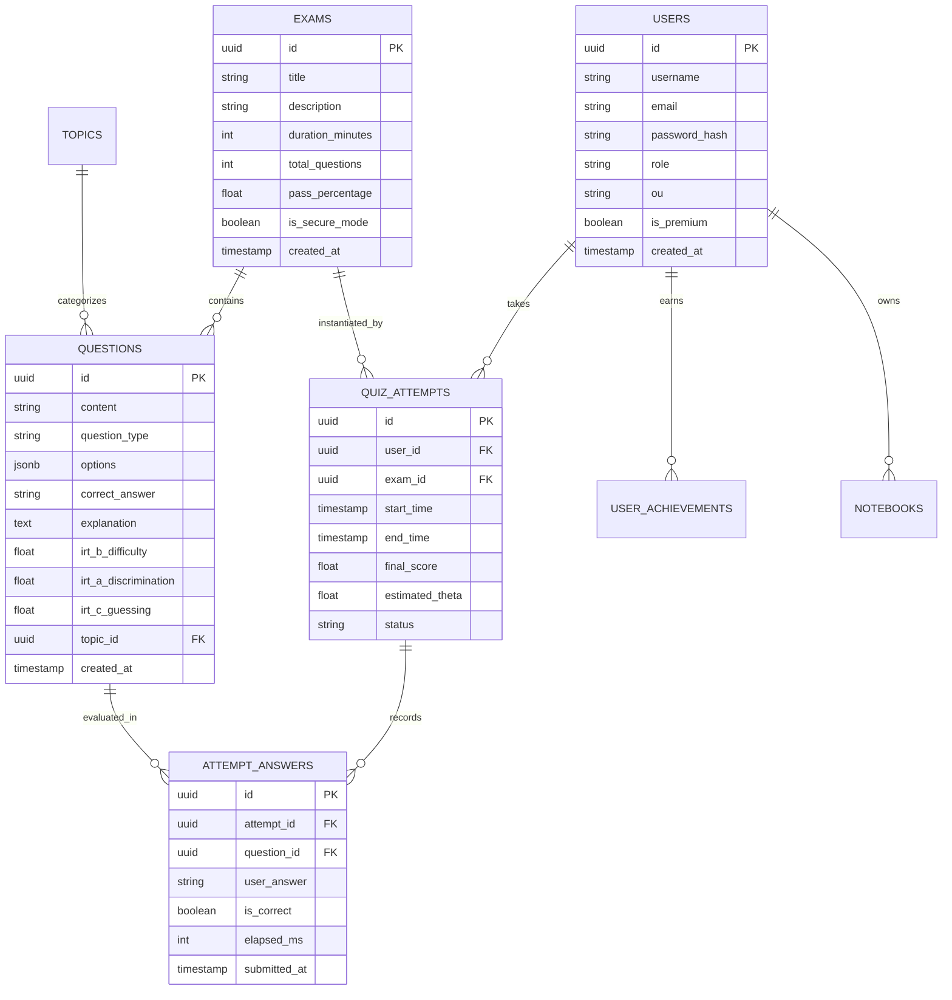
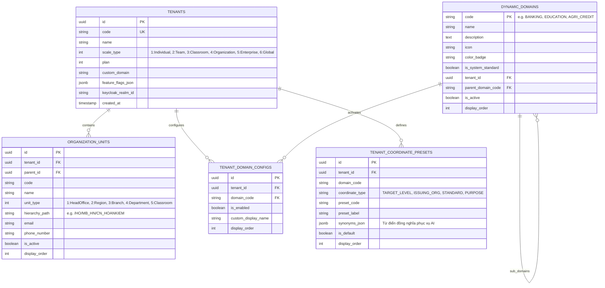

# 📊 Đặc Tả Lược Đồ Dữ Liệu & Mô Hình Thực Thể (Data Models & Schema)

Tài liệu này mô tả chi tiết kiến trúc dữ liệu của **AegisQuiz**, bao gồm cả **Cơ sở dữ liệu Quan hệ Lâu dài (PostgreSQL via EF Core)** và **Cấu trúc Trạng thái Bộ nhớ Tạm thời (In-Memory RAM State)**.

---

## 1. Sơ Đồ Thực Thể Quan Hệ Tổng Thể (ERD)



---

## 2. Các Thực Thể Chính Trong PostgreSQL

### 2.1. Bảng `Questions` (Ngân Hàng Câu Hỏi)
- **`Id`** (`UUID`, PK): Khóa chính.
- **`Content`** (`TEXT`): Nội dung đề bài (hỗ trợ định dạng Markdown và công thức toán LaTeX).
- **`QuestionType`** (`VARCHAR(50)`): `MULTIPLE_CHOICE`, `FILL_IN_BLANK`, `TRUE_FALSE`, `MATCHING`.
- **`Options`** (`JSONB`): Danh sách các phương án lựa chọn `["A. ...", "B. ...", "C. ...", "D. ..."]`.
- **`CorrectAnswer`** (`TEXT`): Đáp án chính xác.
- **`Explanation`** (`TEXT`): Lời giải chi tiết từ giáo viên hoặc sinh tự động bởi Gemini AI.
- **Tham số IRT (Item Response Theory)**:
  - `IrtDifficulty` ($b \in [-3.0, +3.0]$): Độ khó của câu hỏi.
  - `IrtDiscrimination` ($a \in [0.5, 2.5]$): Độ phân biệt năng lực người giỏi và người yếu.
  - `IrtGuessing` ($c \in [0.0, 0.35]$): Xác suất đoán mò ngẫu nhiên (mặc định 0.25 cho trắc nghiệm 4 lựa chọn).

### 2.2. Bảng `QuizAttempts` (Lịch Sử Bài Thi)
- Lưu trữ từng lượt thi của thí sinh:
  - `UserId`, `ExamId`, `StartTime`, `EndTime`.
  - `FinalScore`: Điểm thang 10 hoặc thang 100.
  - `EstimatedTheta`: Điểm năng lực chuẩn hóa $\theta \in [-4.0, +4.0]$.
  - `ViolationCount`: Số lần vi phạm an ninh phòng thi (rời màn hình, mở tab mới, cắm màn hình phụ).

---

## 3. Cấu Trúc Dữ Liệu Bộ Nhớ Đấu Trường (Arena In-Memory Models)

Để phục vụ tốc độ phản xạ mili-giây cho các Gameshow (Olympia, Rung Chuông Vàng, Chiếc Nón Kỳ Diệu...), dữ liệu phòng được biểu diễn bằng các lớp C# lưu trong RAM:

### 3.1. `ArenaRoomState`
```csharp
public class ArenaRoomState
{
    public string RoomId { get; set; }           // Mã phòng (VD: "UKJMJI")
    public string GameCode { get; set; }         // "OLYMPIA", "GOLDEN_BELL"...
    public string RoomName { get; set; }         // Tên phòng do Host đặt
    public string HostUserId { get; set; }       // ID của Host/Trọng tài
    public string CurrentStage { get; set; }     // Tên vòng thi (VD: "KHOI_DONG", "VUOT_CNV")
    public int CurrentQuestionIndex { get; set; }// Vị trí câu hỏi hiện tại
    public List<ArenaQuestionItem> Questions { get; set; } // Danh sách câu hỏi trong trận
    public ConcurrentDictionary<string, ArenaPlayer> Players { get; set; } // Danh sách người chơi
    public string? BuzzerWinnerPlayerId { get; set; } // Thí sinh bấm chuông đầu tiên
    public long BuzzerTimestampMs { get; set; }       // Xung nhịp phần khớp lệnh
    public DateTime StageStartTimeUtc { get; set; }   // Thời điểm bắt đầu vòng
    public int StageDurationSeconds { get; set; }     // Thời lượng của vòng
    public Dictionary<string, object> CustomData { get; set; } // Dữ liệu linh hoạt riêng
}
```

### 3.2. `ArenaPlayer`
```csharp
public class ArenaPlayer
{
    public string Id { get; set; }               // ID hoặc ConnectionId của thí sinh
    public string Name { get; set; }             // Tên hiển thị
    public string Avatar { get; set; }           // Emoji hoặc URL ảnh đại diện
    public int Score { get; set; }               // Điểm số hiện tại trong trận đấu
    public bool IsConnected { get; set; }        // Trạng thái kết nối WebSocket
    public int SeatNumber { get; set; }          // Ghế số (1-100 cho Rung Chuông Vàng)
    public string Status { get; set; }           // "ACTIVE", "ELIMINATED", "BUZZED"
    public string? TeamName { get; set; }        // "Team A", "Team B" (University Challenge)
    public int Streak { get; set; }              // Chuỗi trả lời đúng liên tiếp
    public int StepPosition { get; set; }        // Bậc thang hiện tại (Nhanh Như Chớp)
    public bool StarOfHopeUsed { get; set; }     // Đã dùng Ngôi sao hy vọng hay chưa
}
```

### 3.3. `CustomData` — Dữ Liệu Biến Thiên Theo Từng Gameshow:
- **Olympia**: Lưu trữ trạng thái 4 mảnh ghép hàng ngang `cnvOpenedRows` và ẩn số trung tâm `cnvKeyword`.
- **Chiếc Nón Kỳ Diệu**: Lưu trữ `targetWord` (từ khóa bí mật) và `revealedLetters` (các chữ cái đã được lật mở).
- **Rung Chuông Vàng**: Lưu số lượt cứu trợ còn lại `rescueAttemptsLeft` và danh sách thí sinh được hồi sinh.
- **University Challenge**: Lưu trữ trạng thái mở micro thảo luận nhóm `isTeamMicOpen`.
- **Jeopardy!**: Danh sách các ô ma trận đã được giải `solvedCells`.
- **Nhanh Như Chớp**: Vị trí dốc nghiêng cao nhất đạt được trong 2 phút `maxStepReached`.

---

## 4. Mô Hình Quản Trị Đa Khách Thuê & Cây Tổ Chức Đa Cấp (Kỳ Quan 16)

Hệ thống bổ sung phân hệ thực thể phục vụ **Triết lý Bộc Lộ Độ Phức Tạp Tiệm Tiến** (từ Cá nhân đến Tập đoàn toàn cầu):



### Chiến Lược Đánh Chỉ Mục (Indexing Strategy):
1. **`idx_org_units_tenant_parent`**: `(tenant_id, parent_id)` tối ưu truy vấn nạp cây lồng nhau.
2. **`idx_org_units_hierarchy_path`**: `(hierarchy_path)` tối ưu truy vấn đệ quy tìm tất cả con cháu (`HierarchyPath.StartsWith(...)`).
3. **`idx_tenant_domain_configs_unique`**: `(tenant_id, domain_code) UNIQUE` đảm bảo mỗi tenant chỉ có 1 bản ghi trạng thái cho mỗi ngành.
4. **`idx_tenant_coordinate_presets`**: `(tenant_id, domain_code, coordinate_type)` nạp nhanh bộ từ điển cho AI Cognitive Banner Sniffer.
5. **Global Query Filter**: Tự động chèn `WHERE (tenant_id = @current_tenant_id OR tenant_id = '00000000-0000-0000-0000-000000000000')` vào mọi truy vấn EF Core, cách ly dữ liệu tuyệt đối giữa các ngân hàng/trường học.
