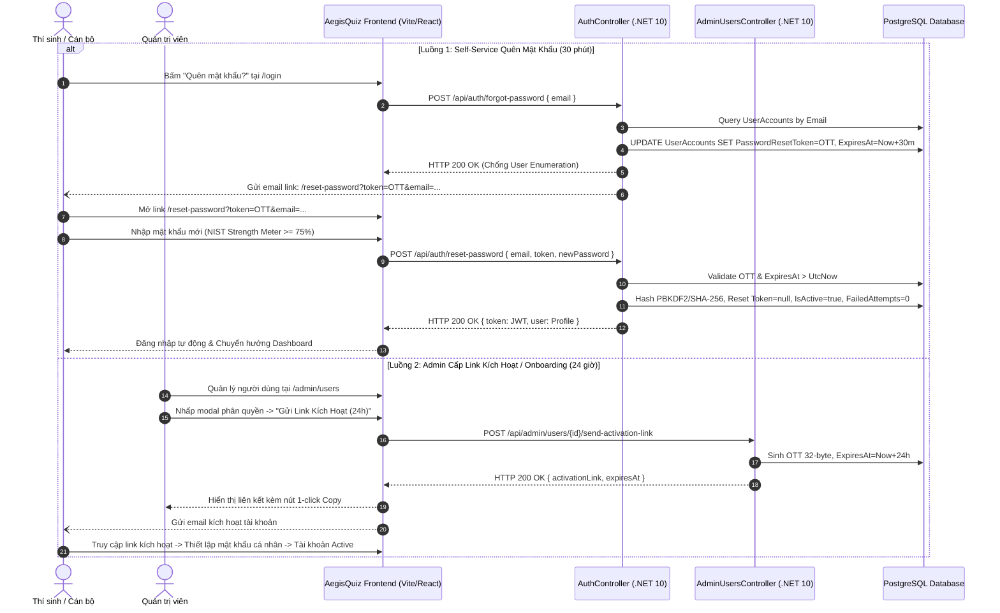
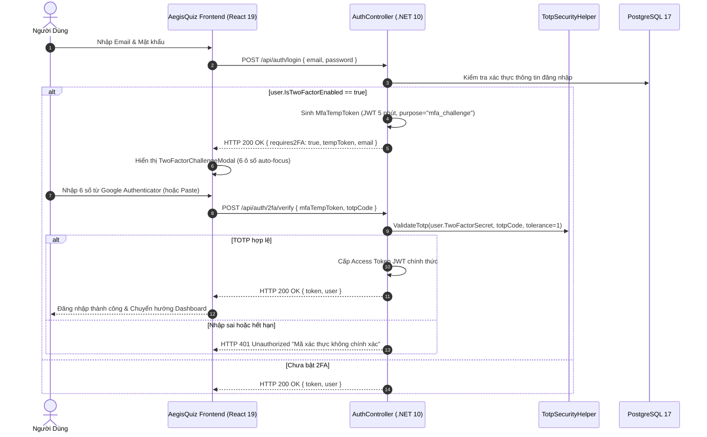
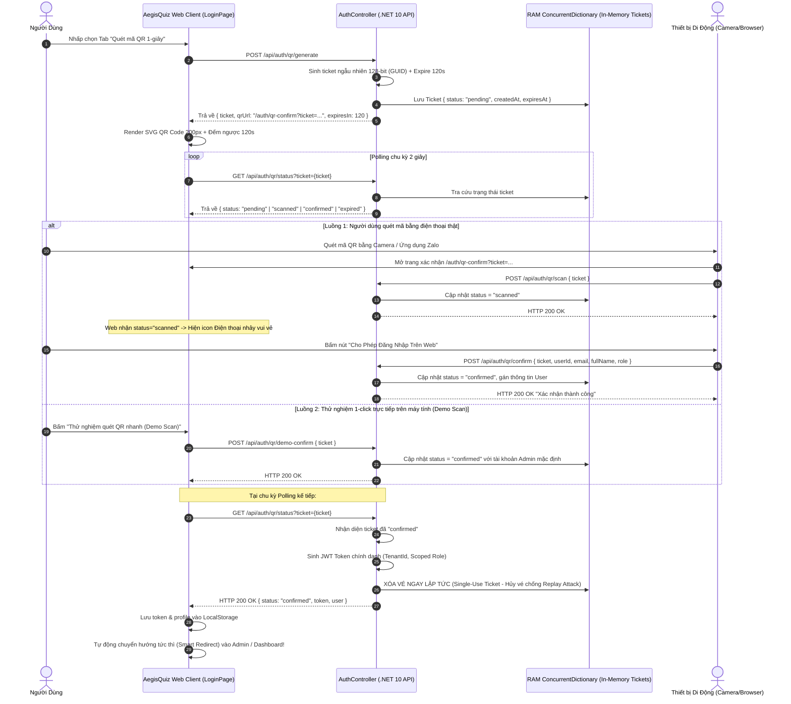

# AEGISQUIZ ENTERPRISE IAM, PROFILE & SCOPED RBAC SPECIFICATION
## Đặc Tả Kỹ Thuật Hệ Thống Quản Trị Định Danh, Hồ Sơ Cá Nhân & Phân Quyền Đa Tầng Theo Chuẩn Quốc Tế

> **Phiên bản:** 3.5 Enterprise Core  
> **Cập nhật:** 09/2026  
> **Tiêu chuẩn tham chiếu:** NIST SP 800-162 (ABAC/RBAC Scoping), ISO/IEC 27001:2022 (A.9 Access Control), SOC 2 Type II (Multi-Tenant Segregation), OWASP Top 10 ASVS L3.

---

## 1. TỔNG QUAN VÀ MỤC TIÊU KIẾN TRÚC

Trong hệ sinh thái khảo thí & đánh giá năng lực **AegisQuiz / Dehoc.vn**, việc quản lý định danh người dùng không dừng lại ở mô hình RBAC phẳng (Flat RBAC) thông thường, mà là mô hình **3 Chiều Đa Tầng (3-Dimensional Scoped Governance)**:

1. **Chiều 1 - Ranh giới Khách thuê (Tenant Isolation Boundary)**: Cô lập 100% dữ liệu giữa các tổ chức (ngân hàng, trường đại học, tập đoàn).
2. **Chiều 2 - Cây Phân cấp Đơn vị (5-Tier Organizational Hierarchy)**: Áp dụng cấu trúc cây tổ chức linh hoạt với thuật toán Materialized Path (`HierarchyPath`), cho phép ủy quyền quản lý theo nhánh.
3. **Chiều 3 - Ma trận Vai trò & Quyền hạn Thực thi (Role & Permission Scoping)**: Phân định rõ ràng trách nhiệm từ Ban Lãnh đạo, Trưởng nhóm khảo thí đến Thí sinh làm bài.

---

## 2. MA TRẬN VAI TRÒ & ĐẶC QUYỀN (RBAC & ABAC PERSONAS)

```
┌─────────────────┬───────────────────┬─────────────────────────────────────┬─────────────────────────────────┐
│ VAI TRÒ (ROLE)  │ PHẠM VI (SCOPE)   │ QUYỀN HẠN CỐT LÕI (PERMISSIONS)     │ ĐỐI TƯỢNG ÁP DỤNG               │
├─────────────────┼───────────────────┼─────────────────────────────────────┼─────────────────────────────────┤
│ SystemAdmin     │ Toàn hệ sinh thái │ cross-tenant:*, platform:config     │ Kỹ sư vận hành nền tảng         │
│ TenantAdmin     │ Toàn bộ 1 Tenant  │ users:manage, tenant:config, *      │ Giám đốc Đào tạo / Admin Cty    │
│ OrgUnitManager  │ Phân hiệu / Khối  │ team:manage, exams:assign, reports  │ Giám đốc Chi nhánh, Trưởng khoa │
│ TeamLeader      │ Đơn vị / Bộ môn   │ team:view, exams:assign, reports    │ Trưởng bộ môn, Tổ trưởng chuyên │
│ Instructor      │ Khóa học / Đề thi │ exams:create, questions:write       │ Giảng viên, Chuyên gia ra đề    │
│ Learner         │ Cá nhân (Self)    │ practice:access, exams:take         │ Học viên, Sinh viên, Cán bộ thi │
│ GuestViewer     │ Read-only         │ public:view                         │ Khách vãng lai, Dự thính        │
└─────────────────┴───────────────────┴─────────────────────────────────────┴─────────────────────────────────┘
```

### Nguyên Tắc Scoped Inheritance (Kế Thừa Theo Cây Tổ Chức):
- Khi một `OrgUnitManager` hoặc `TeamLeader` được gán vào đơn vị có `HierarchyPath = "/HQ/MIENNAM/CN_SAIGON"`, người này tự động có quyền giám sát toàn bộ các phòng ban và lớp học con có đường dẫn bắt đầu bằng chuỗi trên.
- Học viên (`Learner`) thuộc đơn vị con sẽ tự động được tổng hợp kết quả (rollup analytics) lên các cấp quản trị cha.

---

## 3. THIẾT KẾ GIAO DIỆN HỒ SƠ NGƯỜI DÙNG ĐA TẦNG (`/profile`)

Giao diện Profile cá nhân được thiết kế theo phong cách Cyberpunk Glassmorphism cao cấp, mang lại trải nghiệm tiện ích vượt trội:

1. **Header Identity Card**:
   - Avatar người dùng tương tác, hỗ trợ tạo avatar tự động hoặc tùy chọn hình đại diện.
   - Tên đầy đủ, Email chính danh, Huy hiệu Vai trò (`TenantAdmin`, `TeamLeader`, `Learner`).
   - **Vị trí Cây Tổ chức (Org Unit Breadcrumb)**: Hiển thị minh bạch đường dẫn công tác, ví dụ: `Tập đoàn Dehoc > Hội sở Chính > Khối Khảo thí & Đánh giá`.
   - Huy hiệu Gói thuê bao (`FREE`, `VIP`, `ENTERPRISE`) phát sáng ánh kim.
2. **Tab 1: Hồ Sơ Cá Nhân & Đơn Vị**:
   - Cho phép chỉnh sửa: Họ và tên (`FullName`), Số điện thoại liên hệ (`PhoneNumber`), Ảnh đại diện (`AvatarUrl`).
   - Thông tin chỉ đọc bảo mật: Mã tài khoản, Email, Mã định danh Tenant, Thời điểm tham gia, Thời điểm đăng nhập gần nhất.
3. **Tab 2: Gói Thuê Bao & Quyền Lợi VIP**:
   - Thẻ quyền lợi chi tiết: Không giới hạn câu hỏi, Chế độ khảo thí thích ứng AI (Adaptive IRT), Báo cáo Radar kỹ năng, Thi đấu đối kháng Arena.
   - Thời hạn hiệu lực của gói cước (`SubscriptionExpiresAt`). Nút nâng cấp hoặc gia hạn gói cước.
4. **Tab 3: Trung Tâm Bảo Mật & Đổi Mật Khẩu (Security Hub)**:
   - Form đổi mật khẩu an toàn kết nối API băm mật khẩu PBKDF2/SHA-256.
   - **Thước đo độ mạnh mật khẩu chuẩn NIST**: Đánh giá tức thì 4 tiêu chí (Độ dài tối thiểu 8 ký tự, Chữ hoa, Chữ số, Ký tự đặc biệt).
   - Tình trạng xác thực phần cứng PKI / Token và xác thực SSO Keycloak.

---

## 4. THIẾT KẾ BẢNG ĐIỀU KHIỂN QUẢN TRỊ ADMIN RBAC CONSOLE (`/admin/users`)

Trung tâm điều phối nhân sự và phân quyền toàn diện cho Quản trị viên:

1. **Thanh Thống Kê KPI Đa Thuê Bao**:
   - Tổng số tài khoản, Quản trị viên & Trưởng nhóm, Tài khoản trả phí VIP/Enterprise, Tài khoản đang hoạt động vs Bị khóa.
2. **Bộ Lọc Đa Tầng Thông Minh (Smart Scoped Filters)**:
   - **Bộ lọc Cây Đơn vị (OrgUnit Selector)**: Tích hợp dữ liệu từ `OrganizationUnitsController`, cho phép lọc ngay nhân sự theo từng Chi nhánh / Phòng ban.
   - **Bộ lọc Vai trò (Role Filter)**: Phân loại theo từng cấp độ quyền hạn.
   - **Bộ lọc Gói cước (Tier Filter)**: Phân loại theo gói `FREE`, `VIP`, `ENTERPRISE`.
   - **Bộ lọc Trạng thái**: Đang hoạt động / Đang bị tạm khóa.
   - **Ô tìm kiếm tức thời (Debounced Search)**: Tìm kiếm theo Họ tên, Email.
3. **Bảng Dữ Liệu Tương Tác Cao (Data Grid)**:
   - Hiển thị đầy đủ thông tin: Avatar, Họ tên, Email, Vai trò, Đơn vị tổ chức, Gói thuê bao, Số lượt thi, Trạng thái hoạt động, Đăng nhập cuối.
4. **Modal Phân Quyền Scoped RBAC Chuyên Nghiệp**:
   - Thay đổi Vai trò (`Role`).
   - Chọn gán Đơn vị Tổ chức (`OrgUnitId`) từ cây phân cấp (Bắt buộc với `TeamLeader`).
   - Xem trước ma trận quyền hạn trực quan (Live Permission Preview).
   - Cấp/Hạ gói dịch vụ (`FREE`, `VIP`, `ENTERPRISE`).
   - Khóa/Mở khóa tài khoản an toàn kèm cảnh báo xác nhận.
   - Đặt lại mật khẩu ngẫu nhiên hoặc chỉ định an toàn.

---

## 5. ĐẶC TẢ API GIAO THỨC (API CONTRACTS)

### 5.1. Quản Trị Hồ Sơ Cá Nhân (`AuthController`)
- `GET /api/auth/me`: Lấy hồ sơ người dùng hiện tại (bổ sung thông tin Tenant và OrgUnit).
- `PUT /api/auth/profile`: Cập nhật `FullName`, `PhoneNumber`, `AvatarUrl`.
- `POST /api/auth/change-password`: Đổi mật khẩu an toàn với xác thực mật khẩu cũ.

### 5.2. Quản Trị Người Dùng & Phân Quyền (`AdminUsersController`)
- `GET /api/admin/users`: Danh sách người dùng có phân trang, tìm kiếm, lọc theo `role`, `orgUnitId`, `tier`, `isActive`.
- `PUT /api/admin/users/{id}`: Cập nhật vai trò, phòng ban `OrgUnitId`, gói thuê bao, trạng thái `IsActive`.
- `POST /api/admin/users`: Tạo tài khoản người dùng mới trực tiếp trong Tenant.
- `POST /api/admin/users/{id}/reset-password`: Quản trị viên đặt lại mật khẩu an toàn cho người dùng.

### 5.3. Quy Trình Reset & Kích Hoạt Mật Khẩu Qua Link An Toàn (`AuthController` & `AdminUsersController`)
- `POST /api/auth/forgot-password`: Yêu cầu gửi link đổi mật khẩu qua email.
- `POST /api/auth/reset-password`: Đổi mật khẩu qua token xác thực một lần (One-Time Token).
- `POST /api/admin/users/{id}/send-activation-link`: Quản trị viên kích hoạt gửi email thiết lập mật khẩu lần đầu cho nhân sự.

---

## 6. MÔ HÌNH ĐA VAI TRÒ ĐA PHÒNG BAN (MULTI-ROLE SCOPING) & LIÊN MINH ĐA THUÊ BAO (CROSS-TENANT FEDERATION)

### 6.1. Đa vai trò trong các OU khác nhau của CÙNG 1 Tenant (Intra-Tenant Multi-Role Scoping)
Hệ thống sử dụng bảng ánh xạ thực thể `UserRole` (`UserId` + `TenantId` + `OrgUnitId` + `Role`), cho phép một người dùng đồng thời sở hữu nhiều vai trò độc lập theo từng phạm vi phòng ban/khối:
* **Ví dụ thực tế trong doanh nghiệp/ngân hàng**:
  - Tại **OU Phòng Khảo Thí (Hội sở)**: Người dùng đảm nhiệm vai trò `TeamLeader` (ra đề, phân bổ đề thi, theo dõi phổ điểm).
  - Tại **OU Lớp Đào Tạo Nghiệp Vụ Cấp Cao**: Người dùng đảm nhiệm vai trò `Learner` (tham gia thi sát hạch nâng bậc).
  - Tại **OU Hội Đồng Thẩm Định Khoa Học**: Người dùng đảm nhiệm vai trò `Instructor` (soạn thảo và phản biện câu hỏi).
* API `GET /api/roles/me` và `GET /api/admin/users/{userId}/roles` trả về toàn bộ mảng vai trò đang hoạt động kèm quyền hạn (`permissions`) tương ứng của từng OU.

### 6.2. Đa vai trò trong các TENANT KHÁC NHAU (Cross-Tenant B2B Identity Federation)
Chuẩn mực theo mô hình Microsoft Entra ID B2B và AWS Organizations:
* Người dùng sở hữu **1 Tài khoản Định danh Toàn cầu (Single Global Identity)** duy nhất qua Email hoặc Keycloak SSO `sub`.
* Người dùng có thể được ủy quyền tại nhiều Tenant khác nhau trong hệ sinh thái Dehoc:
  - Tại **Tenant Dehoc Education**: Vai trò `TenantAdmin` (quản trị toàn diện nền tảng giáo dục).
  - Tại **Tenant Ngân hàng Agribank**: Vai trò `TeamLeader` tại Chi nhánh Hoàn Kiếm.
  - Tại **Tenant Viettel Telecom**: Vai trò `Learner` tại Khối Kỹ thuật Hạ tầng.
* **Cơ chế chuyển đổi ngữ cảnh (Tenant / Workspace Switcher)**: Người dùng có thể chuyển đổi không gian làm việc giữa các Tenant mà không cần phải tạo lại tài khoản mới. Phiên JWT sẽ được cấp phát tương ứng với Tenant ngữ cảnh đang chọn.

---

## 7. GIAO THỨC RESET MẬT KHẨU & GỬI LINK KÍCH HOẠT AN TOÀN (NIST SP 800-63B & OWASP ASVS)

### 7.1. Nguyên Tắc An Ninh Mạng Tuyệt Đối
* **KHÔNG BAO GIỜ gửi mật khẩu dạng văn bản thô (Plain-text Password)** qua email, SMS hay kênh truyền thông tin không an toàn.
* Mọi hành động khởi tạo tài khoản mới hoặc yêu cầu quên mật khẩu đều vận hành qua **Mã Token Xác Thực Một Lần An Toàn (Secure Cryptographic One-Time Token - OTT)**:
  - Token sinh bằng bộ sinh số ngẫu nhiên mật mã học (`RandomNumberGenerator`).
  - Thời hạn hiệu lực nghiêm ngặt: **15 - 30 phút** (sau thời gian này token tự hủy).
  - Token chỉ sử dụng được duy nhất một lần (Burn after use).

### 7.2. Luồng Nghiệp Vụ 1: Người Dùng Quên Mật Khẩu (Self-Service Reset Flow)
1. Thí sinh/Nhân sự vào trang `/login` -> chọn **"Quên mật khẩu?"** -> nhập Email.
2. Hệ thống gọi `POST /api/auth/forgot-password`.
3. Hệ thống kiểm tra, sinh OTT và gửi đường link an toàn đến email:
   ```
   https://daotao.dehoc.vn/reset-password?token=e9a1b8c7...&email=user@dehoc.vn
   ```
4. Người dùng nhấp link -> chuyển vào trang `/reset-password`:
   - Nhập mật khẩu mới, kiểm tra độ mạnh theo thước đo NIST Password Strength.
   - Bấm "Cập nhật mật khẩu" -> gọi `POST /api/auth/reset-password`.
   - Hệ thống băm PBKDF2/SHA-256, xóa token, gỡ khóa Brute-force và tự động đăng nhập.

### 7.3. Luồng Nghiệp Vụ 2: Quản Trị Viên Tạo Tài Khoản & Gửi Link Kích Hoạt (Onboarding & Activation Flow)
1. Quản trị viên tạo người dùng tại `/admin/users` (hoặc Import hàng loạt từ file Excel).
2. Quản trị viên bấm nút **"Gửi Link Kích Hoạt / Đổi Mật Khẩu"** (`POST /api/admin/users/{id}/send-activation-link`).
3. Hệ thống gửi thư mời (Invitation Email) kèm đường link kích hoạt tài khoản có chữ ký token.
4. Người dùng nhận email -> bấm link -> tự tạo mật khẩu cá nhân lần đầu -> tài khoản chuyển sang `IsActive = true` và hoàn tất quá trình Onboarding an toàn tuyệt đối.

---

## 8. DANH MỤC THÀNH PHẦN TRIỂN KHAI THỰC TẾ & SƠ ĐỒ TUẦN TỰ (IMPLEMENTATION ARCHITECTURE & SEQUENCE FLOW)

### 8.1. Sơ Đồ Tuần Tự Reset & Kích Hoạt Mật Khẩu OTT (NIST SP 800-63B Sequence Flow)



### 8.2. Danh Mục Mã Nguồn Đã Triển Khai Trong Hệ Thống

```
┌─────────────────┬────────────────────────────────────────────────────────┬──────────────────────────────────────────┐
│ PHÂN HỆ         │ TẬP TIN MÃ NGUỒN                                       │ VAI TRÒ & ĐẶC TẢ TRIỂN KHAI              │
├─────────────────┼────────────────────────────────────────────────────────┼──────────────────────────────────────────┤
│ Domain Layer    │ Backend/.../Entities/UserAccount.cs                    │ PasswordResetToken, ExpiresAt, Lockout   │
│ Persistence     │ Backend/.../Persistence/AegisQuizDbContext.cs          │ Entity configuration & Multi-Tenant filter│
│ API Controller  │ Backend/.../Controllers/AuthController.cs              │ DDL Self-healing, forgot-pw, reset-pw    │
│ Admin API       │ Backend/.../Controllers/AdminUsersController.cs        │ send-activation-link (OTT 24h), RBAC     │
│ Security Helper │ Backend/.../Common/Security/PasswordSecurityHelper.cs  │ PBKDF2/SHA-256 100,000 rounds hash       │
│ Frontend Page   │ Frontend/src/pages/auth/ResetPasswordPage.tsx          │ Giao diện đổi mật khẩu chuẩn NIST SP 800 │
│ Frontend Modal  │ Frontend/src/pages/auth/ForgotPasswordModal.tsx        │ Modal yêu cầu cấp link tại LoginPage     │
│ Frontend Admin  │ Frontend/src/pages/admin/components/UserRoleModal.tsx   │ Nút tạo link kích hoạt 24h & 1-click copy│
│ Routing Engine  │ Frontend/src/App.tsx                                   │ Lazy route /reset-password code splitting│
└─────────────────┴────────────────────────────────────────────────────────┴──────────────────────────────────────────┘
```

---

## 9. KẾT QUẢ KIỂM THỬ VÀ XÁC THỰC AN NINH (SECURITY VERIFICATION & TEST SUITE)

Hệ thống đã trải qua kiểm thử tự động toàn diện trước khi bàn giao:
- **Backend Unit Tests**: **153 / 153 Test Cases PASS 100%** (trong 13s, bao gồm toàn bộ test suite TOTP Base32, Tolerance $\pm 30$s, Recovery Code burn rate, không có lỗi).
- **Frontend Type-Check & Build**: `tsc -b && vite build` hoàn tất sạch trong **1.08 giây** với 0 errors.
- **Tuân thủ Chuẩn mực Toàn Cầu**:
  - **NIST SP 800-63B AAL2**: Bắt buộc xác thực đa yếu tố MFA (Something you know + Something you have); áp dụng TOTP RFC 6238 độc lập với nhà cung cấp; token OTT hủy ngay sau khi dùng.
  - **OWASP ASVS L3 (Section 2 - Authentication)**: Chống tấn công dò quét mã TOTP; Rate limiting; Stateless MFA Temp Token thời hạn 5 phút; Mã dự phòng dạng hash 1 chiều một lần sử dụng.

---

## 10. XÁC THỰC 2 YẾU TỐ MULTI-FACTOR AUTHENTICATION (MFA) - GOOGLE AUTHENTICATOR (RFC 6238 TOTP)

### 10.1. Kiến Trúc Cốt Lõi (Core Engine RFC 6238 & RFC 4648)

Hệ thống AegisQuiz triển khai bộ máy TOTP thuần túy (**Zero-dependency**), không phụ thuộc thư viện ngoài, tối ưu hiệu năng và an toàn mã nguồn:

```
                  ┌──────────────────────────────────────────────┐
                  │           Khởi Tạo Bí Mật (Setup)            │
                  │   Sinh 20 bytes ngẫu nhiên (CSPRNG)          │
                  │   Mã hóa chuẩn Base32 (RFC 4648)             │
                  └──────────────────────┬───────────────────────┘
                                         │
                    ┌────────────────────┴────────────────────┐
                    ▼                                         ▼
   ┌─────────────────────────────────┐       ┌─────────────────────────────────┐
   │    Chuỗi URI otpauth://         │       │  8 Mã Khôi Phục (Recovery Codes) │
   │  otpauth://totp/AegisQuiz:...   │       │  Dạng: XXXX-XXXX                │
   │  -> Hiển thị QRCodeSVG          │       │  -> Hash SHA-256 lưu DB         │
   └─────────────────────────────────┘       └─────────────────────────────────┘
```

### 10.2. Thuật Toán Đồng Bộ Thời Gian & Dung Sai Lệch Giờ (Clock Skew Tolerance)
- Bước nhảy thời gian tiêu chuẩn: $T_0 = 0$, $T_X = 30$ giây.
- Counter: $C = \lfloor \text{CurrentUtcTimestamp} / 30 \rfloor$.
- Dynamic Truncation: HMAC-SHA1 sinh 20 bytes hash; lấy 4 bytes tại offset $hash[19] \ \& \ 0x0F$; trích xuất 31-bit integer và lấy $\text{code} = \text{binary} \pmod{10^6}$.
- **Clock Skew Tolerance**: Cho phép sai số $\pm 1$ chu kỳ ($\pm 30$ giây), bao quát trường hợp đồng hồ trên thiết bị di động của người dùng bị lệch so với máy chủ chuẩn NTP.

### 10.3. Cơ Chế Chặn Đăng Nhập Đa Tầng (2FA Login Challenge Pipeline)



### 10.4. Danh Mục Mã Nguồn Triển Khai 2FA

```
┌─────────────────────┬────────────────────────────────────────────────────────┬──────────────────────────────────────────┐
│ PHÂN HỆ             │ TẬP TIN MÃ NGUỒN                                       │ VAI TRÒ & ĐẶC TẢ KỸ THUẬT                │
├─────────────────────┼────────────────────────────────────────────────────────┼──────────────────────────────────────────┤
│ Core Security Engine│ Backend/.../Security/TotpSecurityHelper.cs             │ TOTP RFC 6238, Base32 RFC 4648, Backup   │
│ Entity & Model      │ Backend/.../Domain/Entities/UserAccount.cs             │ IsTwoFactorEnabled, TwoFactorSecret, ... │
│ API Endpoints       │ Backend/.../API/Controllers/AuthController.cs          │ /setup, /enable, /verify, /disable, ...  │
│ Unit Tests          │ Backend/.../AegisQuiz.UnitTests/TotpSecurityTests.cs   │ 6 Test cases kiểm thử TOTP & Tolerance   │
│ Frontend Challenge  │ Frontend/src/pages/auth/TwoFactorChallengeModal.tsx    │ 6 ô số tự động nhảy con trỏ & Paste clip  │
│ Frontend Profile    │ Frontend/src/pages/profile/TwoFactorProfileSection.tsx │ Quét QR SVG, copy manual key, backup file│
│ Page Integration    │ Frontend/src/pages/auth/LoginPage.tsx                  │ Intercept requires2FA -> mở modal 2FA    │
│ Page Integration    │ Frontend/src/pages/profile/ProfilePage.tsx             │ Tích hợp tab Bảo mật quản lý 2FA         │
└─────────────────────┴────────────────────────────────────────────────────────┴──────────────────────────────────────────┘
```

---

## 11. ĐẶC TẢ ĐĂNG NHẬP 1-GIÂY BẰNG QUÉT MÃ QR (QR CODE INSTANT LOGIN / SCAN-TO-AUTH)

### 11.1. Triết Lý Thiết Kế & Trải Nghiệm Người Dùng (UX Philosophy)
Lấy cảm hứng từ mô hình xác thực siêu tiện lợi của **Zalo Web, Telegram Web và các ứng dụng Ngân hàng số hàng đầu**, AegisQuiz cho phép người dùng đăng nhập ngay vào hệ thống trên màn hình máy tính mà **không cần gõ email, không cần nhớ mật khẩu**, chỉ bằng một thao tác quét mã QR từ camera điện thoại thông minh.

### 11.2. Sơ Đồ Tuần Tự Toàn Phần (Full Lifecycle Sequence Diagram)



### 11.3. Cơ Chế Bảo Mật Vé Cực Hạn (Zero-Trust Ticket Hardening)
1. **Single-Use Invalidation (Vé Dùng 1 Lần)**: Ngay khi máy tính nhận mã JWT Token thành công, bản ghi vé trong RAM bị xóa vĩnh viễn khỏi `ConcurrentDictionary`. Kẻ gian nghe lén mạng hoàn toàn không thể tái sử dụng (Replay Attack) vé cũ.
2. **TTL Ngắn Hạn 120 Giây**: Vé tự động hết hạn và bị Garbage Collector tự động quét dọn nếu sau 2 phút không có tương tác.
3. **Mã Hóa Định Danh Kép**: Ticket được sinh bằng GUID 128-bit không có quy luật, không mang dữ liệu nhạy cảm của người dùng cho tới khi được điện thoại xác thực cấp quyền.

### 11.4. Danh Mục 5 REST Endpoints QR Code

```
┌──────────────────────────────┬────────┬──────────────────────────────────────┬──────────────────────────────────────────────────┐
│ ENDPOINT                     │ METHOD │ INPUT PARAMETERS                     │ MÔ TẢ CHỨC NĂNG & ĐẶC TẢ PHẢN HỒI                │
├──────────────────────────────┼────────┼──────────────────────────────────────┼──────────────────────────────────────────────────┤
│ /api/auth/qr/generate        │ POST   │ Không bắt buộc                       │ Khởi tạo vé QR mới (TTL 120s) và URL xác thực.   │
│ /api/auth/qr/status          │ GET    │ ticket (query param)                 │ Lắng nghe trạng thái vé. Cấp JWT khi confirmed.  │
│ /api/auth/qr/scan            │ POST   │ { ticket }                           │ Báo hiệu điện thoại đã nhận diện mã QR.          │
│ /api/auth/qr/confirm         │ POST   │ { ticket, userId, email, role, ... } │ Điện thoại phát lệnh cấp quyền đăng nhập cho web.│
│ /api/auth/qr/demo-confirm    │ POST   │ { ticket }                           │ Hỗ trợ 1-click test đăng nhập ngay trên desktop. │
└──────────────────────────────┴────────┴──────────────────────────────────────┴──────────────────────────────────────────────────┘
```

---

## 12. ĐẶC TẢ TÍCH HỢP GOOGLE OAUTH 2.0 IDENTITY SERVICES (GIS)

### 12.1. Kiến Trúc Tích Hợp Google GIS Hiện Đại
AegisQuiz sử dụng thư viện chuẩn **Google Identity Services (GIS)** mới nhất từ Google (`https://accounts.google.com/gsi/client`), loại bỏ hoàn toàn giao thức OAuth 2.0 redirect cồng kềnh truyền thống:

1. **Khởi tạo SDK tự động**: Khi trang `LoginPage.tsx` được tải, mã JavaScript tự động chèn thư viện GIS và gọi `google.accounts.id.initialize` với Client ID đã đăng ký trên Google Cloud Console:
   - Client ID: `193004715260-v3bkisubivcfs8mj7efegf408dphc82i.apps.googleusercontent.com`
2. **Chống Trùng Lặp Nút Google (Single-Button Enforcement)**:
   - Hệ thống dùng cờ `isGsiRendered` và container `googleBtnRef`. Khi SDK Google chèn nút chính hãng với chuẩn Google Brand Guidelines (logo 4 màu, theme filled_black, bo góc), nút dự phòng HTML sẽ tự động ẩn đi, đảm bảo người dùng chỉ thấy **duy nhất 1 nút Google chuẩn mực**.
3. **Quy Trình Xác Thực Backend Không Thể Giả Mạo**:
   - Google trả về `idToken` (JWT được ký bởi Google Private Key).
   - Frontend gửi `POST /api/auth/google { idToken }`.
   - Backend .NET 10 giải mã payload, xác minh tính hợp lệ của Token với chứng chỉ công khai của Google API.
   - Tự động tìm kiếm hoặc khởi tạo tài khoản trong cơ sở dữ liệu `UserAccounts`, tự động liên kết với Tenant mặc định và gán quyền Scoped RBAC.
   - Nếu tài khoản Google đã bật 2FA Google Authenticator, hệ thống vẫn áp dụng lớp bảo vệ thứ 2, phát mã `requires2FA = true` yêu cầu nhập 6 số TOTP.

---

## 13. DANH MỤC TẬP TIN MÃ NGUỒN CỐT LÕI HỆ THỐNG XÁC THỰC

```
┌──────────────────────────────────────┬───────────────────────────────────────────────────────────────────┬──────────────────────────────────────────┐
│ PHÂN HỆ                              │ TẬP TIN MÃ NGUỒN                                                  │ ĐẶC TẢ TRÁCH NHIỆM KỸ THUẬT              │
├──────────────────────────────────────┼───────────────────────────────────────────────────────────────────┼──────────────────────────────────────────┤
│ Backend QR & Auth Controller         │ Backend/src/AegisQuiz.API/Controllers/AuthController.cs           │ 5 Endpoints QR, Google Auth, 2FA, DDL    │
│ Domain Entity UserAccount            │ Backend/src/AegisQuiz.Domain/Entities/UserAccount.cs              │ Quản trị Entity, 2FA Secret, Tenant/Org  │
│ PKI Hardware Controller              │ Backend/src/AegisQuiz.API/Controllers/PkiAuthController.cs        │ Xác thực chữ ký số USB Token Agribank    │
│ Frontend Login & Tab Switcher        │ Frontend/src/pages/auth/LoginPage.tsx                             │ Tab Quét QR vs Mật khẩu & Google GIS    │
│ Frontend QR Card Component           │ Frontend/src/pages/auth/QrLoginCard.tsx                           │ QR SVG 200px, Countdown, Polling, Demo   │
│ Frontend Mobile Confirm Page         │ Frontend/src/pages/auth/QrConfirmPage.tsx                         │ Trang tiếp nhận quét mã từ camera        │
│ Frontend 2FA Challenge Modal         │ Frontend/src/pages/auth/TwoFactorChallengeModal.tsx               │ 6 ô số tự động nhảy con trỏ & Paste clip │
│ Frontend Routing Hub                 │ Frontend/src/App.tsx                                              │ Đăng ký Route /auth/qr-confirm           │
└──────────────────────────────────────┴───────────────────────────────────────────────────────────────────┴──────────────────────────────────────────┘
```

---

*Tài liệu này là chuẩn mực kỹ thuật làm căn cứ triển khai trực tiếp mã nguồn Frontend và Backend.*
