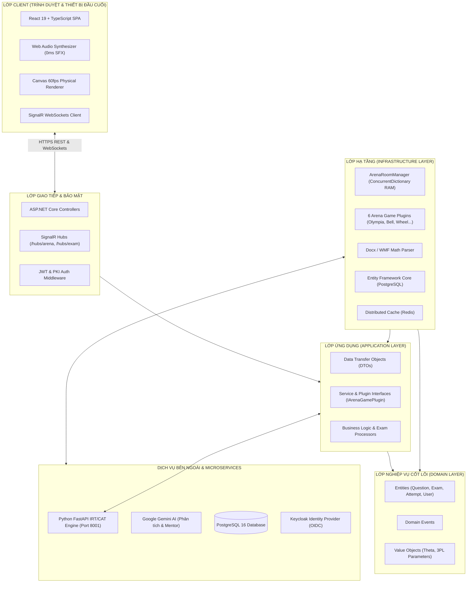

# 🏛️ Tài Liệu Kiến Trúc Tổng Thể Hệ Thống (System Architecture)

> **Dự án**: AegisQuiz — Nền Tảng Khảo Thí & Đấu Trường Gameshow Trí Tuệ Thế Hệ Mới  
> **Phiên bản tài liệu**: 2.0  
> **Cập nhật gần nhất**: Tháng 9/2026

---

## 1. Mục Tiêu & Nguyên Lý Thiết Kế

Hệ thống **AegisQuiz** được xây dựng dựa trên 4 nguyên lý kiến trúc nền tảng:
1. **Clean Architecture & Separation of Concerns (SoC)**: Tách biệt hoàn toàn giữa Tầng Miền (Domain), Tầng Ứng dụng (Application), Tầng Hạ tầng (Infrastructure) và Tầng Giao diện/API (Presentation/API).
2. **Microservices & Polyglot Architecture**:
   - .NET 10 Web API đảm nhận các nghiệp vụ cốt lõi, quản lý phòng thi, giao dịch, xác thực và truyền thông thời gian thực (SignalR WebSockets).
   - Python FastAPI Microservice chuyên sâu đảm nhận tính toán ma trận thống kê khảo thí thích ứng theo mô hình Item Response Theory (IRT).
3. **Pluggable & Extensible Design**: Cơ chế Plugin Architecture cho phép bổ sung các thể thức Gameshow mới mà không cần biên dịch lại hoặc sửa đổi mã nguồn khung cốt lõi.
4. **Zero-Latency In-Memory Execution**: Tách biệt luồng xử lý tương tác thời gian thực (RAM-based microsecond coordination) với luồng lưu trữ lâu dài (Database persistence) để loại bỏ hiện tượng thắt cổ chai I/O.

---

## 2. Sơ Đồ Kiến Trúc Phân Tầng (Layered Architecture)

---

## 3. Chi Tiết Các Tầng Kiến Trúc

### 3.1. Lớp Trình Diễn (Presentation & API Layer)
- **`AegisQuiz.API`**:
  - `Controllers/`: Xử lý các REST request chuẩn hóa, xác thực phân quyền, rate limiting.
  - `Hubs/ArenaHub.cs`: Trạm tiếp nhận và phát sóng sự kiện Real-time hai chiều cho các phòng đấu trường Gameshow.
  - `Program.cs`: Nơi cấu hình Dependency Injection (DI) cho tất cả các Service, Plugin, SignalR Hub và Middleware.

### 3.2. Lớp Ứng Dụng (Application Layer)
- **`AegisQuiz.Application`**:
  - `Interfaces/IArenaGamePlugin.cs`: Bản hợp đồng quy định mọi hành vi của một Gameshow (Khởi tạo, Bấm chuông, Tính điểm, Xử lý hành động, Chuyển vòng).
  - `DTOs/`: Chứa các đối tượng truyền dữ liệu độc lập với cấu trúc bảng cơ sở dữ liệu.

### 3.3. Lớp Nghiệp Vụ Cốt Lõi (Domain Layer)
- **`AegisQuiz.Domain`**:
  - Không phụ thuộc vào bất kỳ thư viện bên ngoài hay cơ sở dữ liệu nào.
  - Chứa các thực thể: `QuestionItem`, `QuizAttempt`, `ExamSession`, `UserAchievement`, `TopicPath`.

### 3.4. Lớp Hạ Tầng (Infrastructure Layer)
- **`AegisQuiz.Infrastructure`**:
  - `Arena/ArenaRoomManager.cs`: Engine điều phối phòng thi đấu in-memory độ trễ thấp với độ chính xác microsecond.
  - `Arena/ArenaGamePlugins.cs`: Nơi chứa mã nguồn thực thi của 6 thể thức Gameshow (`OlympiaPlugin`, `GoldenBellPlugin`, `LuckyWheelPlugin`, `UniversityChallengePlugin`, `JeopardyPlugin`, `LightningPlugin`).
  - `Data/`: Chứa DbContext của Entity Framework Core kết nối PostgreSQL.
  - `Parser/`: Chứa công cụ đọc file `.docx`, giải mã hình ảnh Vector WMF thành PNG/SVG, trích xuất công thức toán OMML sang chuẩn LaTeX.

---

## 4. Mô Hình Xử Lý Dữ Liệu Thời Gian Thực (Real-time Flow)

Khi một thí sinh bấm nút chuông cướp quyền trả lời (Buzzer):
1. **Client**: Ghi nhận thời điểm bấm của thí sinh (`clientTimestamp = performance.now()`), phát âm thanh tại chỗ 0ms bằng `Web Audio API` và bắn lệnh SignalR `RingBuzzer(roomId, timestamp)` lên Server.
2. **Server (`ArenaHub`)**: Chuyển tiếp tới `ArenaRoomManager.RingBuzzer()`.
3. **Lock & Microsecond Arbitration**:
   - Hệ thống áp dụng `lock (room)` phạm vi phòng thi.
   - Kiểm tra `room.BuzzerWinnerPlayerId`: Nếu chưa ai bấm thì gán quyền cho người chơi hiện tại, lấy xung nhịp phần cứng `Stopwatch.GetTimestamp()` làm bằng chứng trọng tài.
   - Nếu đã có người bấm trước (dù chỉ nhanh hơn 1 mili-giây), yêu cầu sau sẽ bị từ chối ngay lập tức mà không gây nghẽn luồng.
4. **Broadcast**: `ArenaHub` phát sự kiện `BuzzerWon(winnerId, winnerName)` đến tất cả client trong phòng để cập nhật giao diện sáng đèn bục thí sinh đồng loạt.

---

## 5. Phân Hệ Độc Lập: Python IRT Microservice

Dịch vụ chạy tại cổng `8001` với FastAPI:
- Nhận lịch sử làm bài của thí sinh qua HTTP endpoint `/api/adaptive/next-question`.
- Sử dụng mô hình toán xác suất 3 tham số **3PL (Three-Parameter Logistic Model)**:
  $$P_i(\theta) = c_i + \frac{1 - c_i}{1 + e^{-1.7 a_i (\theta - b_i)}}$$
  - $\theta$ (*Theta*): Năng lực ước lượng hiện tại của thí sinh.
  - $b_i$: Độ khó của câu hỏi $i$.
  - $a_i$: Độ phân biệt của câu hỏi $i$.
  - $c_i$: Xác suất đoán mò ngẫu nhiên.
- Tính toán hàm thông tin câu hỏi (Fisher Information) và chọn ra câu hỏi tiếp theo tối đa hóa lượng thông tin thu được về năng lực người học, giúp rút ngắn thời gian làm bài từ 50 câu xuống còn 15-20 câu mà vẫn đạt độ chính xác tương đương.
