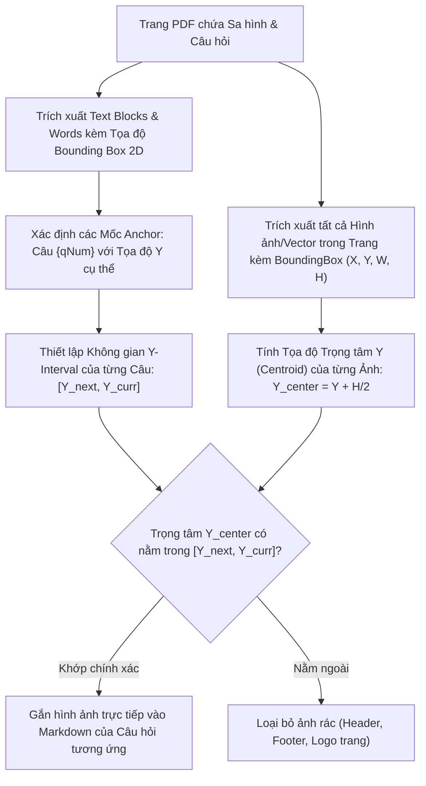

# 🚦 Phân Hệ Khảo Thí & Sát Hạch Lái Xe Quốc Gia (National Driving License Exam Module)
### *Hệ Thống Sát Hạch Lý Thuyết & Sa Hình Chuẩn Cục Đường Bộ Việt Nam (Bộ GTVT)*

---

## 1. TỔNG QUAN & CĂN CỨ PHÁP LÝ

Phân hệ Sát hạch Lái xe Quốc gia (GPLX Subsystem) trên AegisQuiz được thiết kế nhằm mục tiêu:
1. **Chuẩn hóa 100% theo Quy định Quốc gia**: Tuân thủ Thông tư 12/2017/TT-BGTVT, Thông tư 38/2019/TT-BGTVT và bộ 600 câu hỏi lý thuyết sát hạch lái xe cơ giới đường bộ do Cục Đường Bộ Việt Nam ban hành.
2. **Loại trừ tận gốc tai nạn giao thông**: Thông qua cơ chế **60 câu hỏi điểm liệt tử thần (`isCritical: true`)**, buộc người học phải nắm vững các tình huống tuyệt đối không được vi phạm (nồng độ cồn, ma túy, đường sắt, nhường đường xe ưu tiên, vượt cẩu hẹp...).
3. **Trí tuệ nhân tạo giải mã Sa hình (AI Diagram Solver)**: Thay thế việc học vẹt đáp án bằng cách phân tích bản chất thế xe theo 4 quy tắc vàng kinh điển của luật giao thông đường bộ.
4. **Mô phỏng 120 tình huống nguy hiểm (Hazard Perception Test)**: Huấn luyện phản xạ bấm phím kịp thời khi phát hiện nguy cơ tai nạn tiềm ẩn trên video hành trình thực tế.

---

## 2. MA TRẬN PHÂN BỔ ĐỀ THI & ĐIỀU KIỆN ĐẠT CÁC HẠNG GPLX

Mỗi đề thi được sinh ngẫu nhiên từ ngân hàng 600 câu hỏi dựa trên ma trận phân bổ chuẩn, đảm bảo tính khách quan và bao phủ toàn bộ kiến thức:

| Hạng GPLX | Phương Tiện Áp Dụng | Số Câu Hỏi | Thời Gian | Điểm Đạt Yêu Cầu | Số Câu Điểm Liệt | Điều Kiện Đạt Đặc Biệt |
| :--- | :--- | :--- | :--- | :--- | :--- | :--- |
| **A1** | Môtô 2 bánh dung tích xi-lanh từ 50cm³ đến dưới 175cm³ | 25 câu | 19 phút | **21 / 25** (84%) | 1 - 2 câu | **Không sai câu điểm liệt** |
| **A2** | Môtô 2 bánh phân khối lớn từ 175cm³ trở lên | 25 câu | 19 phút | **23 / 25** (92%) | 1 - 2 câu | **Không sai câu điểm liệt** |
| **A3, A4** | Môtô 3 bánh, xe máy kéo nhỏ đến 1000kg | 25 câu | 19 phút | **22 / 25** (88%) | 1 - 2 câu | **Không sai câu điểm liệt** |
| **B1 (Tự động)**| Ôtô số tự động chở người đến 9 chỗ, xe tải tự động < 3.5T | 30 câu | 20 phút | **27 / 30** (90%) | 1 - 2 câu | **Không sai câu điểm liệt** |
| **B2 (Số sàn)** | Ôtô chở người đến 9 chỗ, xe tải < 3.5 tấn (kinh doanh) | 35 câu | 22 phút | **32 / 35** (91.4%)| 2 - 3 câu | **Không sai câu điểm liệt** |
| **C (Tải nặng)**| Ôtô tải, đầu kéo từ 3.5 tấn trở lên | 40 câu | 24 phút | **36 / 40** (90%) | 2 - 3 câu | **Không sai câu điểm liệt** |
| **D, E, F** | Xe chở khách > 30 chỗ, xe container kéo rơ-moóc | 45 câu | 26 phút | **41 / 45** (91.1%)| 3 - 4 câu | **Không sai câu điểm liệt** |

---

## 3. THUẬT TOÁN KHÓA "60 CÂU ĐIỂM LIỆT TỬ THẦN" (`FATAL_FAIL_ENGINE`)

### 3.1. Nguyên Lý Vận Hành
Trong cấu trúc dữ liệu câu hỏi, các câu hỏi điểm liệt được đánh dấu cờ `isCritical = true`. Khi thí sinh nộp bài hoặc chọn sai câu hỏi này, thuật toán chấm điểm sẽ kích hoạt trạng thái `FATAL_FAIL`:

```typescript
// Core Engine: Đánh giá kết quả sát hạch GPLX
export interface GplxEvaluationResult {
  score: number;
  totalQuestions: number;
  isPassed: boolean;
  isFatalFail: boolean;
  fatalQuestionId?: string;
  verdict: 'DAT' | 'KHONG_DAT' | 'LIET_TOAN_BAI';
}

export function evaluateGplxAttempt(
  userAnswers: Record<string, string>,
  questions: Question[],
  passingScore: number
): GplxEvaluationResult {
  let correctCount = 0;
  let fatalFailed = false;
  let fatalId: string | undefined;

  for (const q of questions) {
    const isCorrect = userAnswers[q.id] === q.correctAnswer;
    if (isCorrect) {
      correctCount++;
    } else if (q.isCritical) {
      fatalFailed = true;
      fatalId = q.id;
    }
  }

  // Nếu sai câu điểm liệt -> TỨC KHẮC TRƯỢT SÁT HẠCH!
  if (fatalFailed) {
    return {
      score: correctCount,
      totalQuestions: questions.length,
      isPassed: false,
      isFatalFail: true,
      fatalQuestionId: fatalId,
      verdict: 'LIET_TOAN_BAI'
    };
  }

  const isPassed = correctCount >= passingScore;
  return {
    score: correctCount,
    totalQuestions: questions.length,
    isPassed,
    isFatalFail: false,
    verdict: isPassed ? 'DAT' : 'KHONG_DAT'
  };
}
```

### 3.2. Chế Độ Luyện Thi Độc Quyền: `gplx_fatal_only`
AegisQuiz cung cấp chế độ lọc chuyên biệt chỉ gồm **60 câu hỏi điểm liệt**. Người học có thể luyện liên tục cho đến khi đạt tỷ lệ chính xác 100%, tạo phản xạ nhận thức bất khả xâm phạm về các tình huống sinh tử khi tham gia giao thông.

---

## 4. BỘ GIẢI MÃ SA HÌNH THẾ XE AI (AI DIAGRAM SOLVER)

### 4.1. Khẩu Quyết 4 Tầng Kinh Điển
Hệ thống AI tự động phân tích ma trận biển báo và vị trí phương tiện trong giao lộ bằng 4 bước ưu tiên tuần tự:

```
                      ┌───────────────────────────────────────────────┐
                      │    BƯỚC 1: NHẤT CHỚM                         │
                      │    Xe đã vào ngã tư trước được đi trước       │
                      └──────────────────────┬────────────────────────┘
                                             │
                                             ▼
                      ┌───────────────────────────────────────────────┐
                      │    BƯỚC 2: NHÌ ƯU                            │
                      │    Hỏa (Cứu hỏa) ➔ Sự (Quân sự) ➔             │
                      │    Công (Công an) ➔ Thương (Cứu thương)      │
                      └──────────────────────┬────────────────────────┘
                                             │
                                             ▼
                      ┌───────────────────────────────────────────────┐
                      │    BƯỚC 3: TAM ĐƯỜNG                         │
                      │    Xe trên đường ưu tiên (biển hình thoi vàng)│
                      └──────────────────────┬────────────────────────┘
                                             │
                                             ▼
                      ┌───────────────────────────────────────────────┐
                      │    BƯỚC 4: TỨ HƯỚNG                          │
                      │    Bên phải không vướng: Rẽ phải ➔ Thẳng ➔ Trái│
                      └───────────────────────────────────────────────┘
```

### 4.2. Trích Xuất Lập Luận Giải Thích Tự Động
Khi người học chọn sai thế sa hình, AI Mentor Socrates lập tức hiển thị sơ đồ phân luồng kèm lập luận rõ ràng:
- *Ví dụ*: *"Xe Cứu thương đi trước vì là xe ưu tiên theo Luật Giao thông (Bước 2: Nhì ưu). Xe Con đi thứ hai vì đang lưu thông trên đường có biển báo Đường ưu tiên (Bước 3: Tam đường). Xe Tải rẽ trái nên phải nhường đường cho xe đi thẳng (Bước 4: Tứ hướng)."*

---

## 5. BỘ MÔ PHỎNG 120 TÌNH HUỐNG GIAO THÔNG (HAZARD PERCEPTION SIMULATOR)

Ngoài lý thuyết 600 câu, AegisQuiz hỗ trợ phần mềm thi mô phỏng 120 tình huống giao thông thực tế:
- **Cơ chế bắt sự kiện phím Spacebar**: Người học quan sát video clip (Full HD 60fps) từ góc nhìn người lái xe.
- **Thời điểm vàng (Golden Window)**: Mỗi tình huống có một cửa sổ thời gian nguy hiểm kéo dài 5 giây, chia thành 5 mốc điểm:
  - Bấm trong giây thứ nhất (vừa xuất hiện dấu hiệu nguy hiểm): **5 điểm**.
  - Bấm trong giây thứ 2: **4 điểm**.
  - Bấm trong giây thứ 3: **3 điểm**.
  - Bấm trong giây thứ 4: **2 điểm**.
  - Bấm trong giây thứ 5: **1 điểm**.
  - Bấm quá sớm (chưa có nguy hiểm) hoặc quá muộn (đã xảy ra va chạm): **0 điểm**.
- **Điều kiện Đạt phần thi Mô phỏng**: Đạt từ **35 / 50 điểm** trở lên (10 tình huống ngẫu nhiên).

---

## 6. GIAO DIỆN PHÒNG THI SÁT HẠCH LÝ THUYẾT (EXAM ROOM SIMULATION)

Giao diện thi thử GPLX trên AegisQuiz được thiết kế đồng bộ với phần mềm sát hạch chính thức của Tổng cục Đường bộ:
1. **Bảng lưới chọn câu hỏi**: Ô màu xám (chưa làm), ô màu xanh lá (đã chọn đáp án), ô viền vàng (câu hỏi đang chọn).
2. **Hỗ trợ phím tắt Numpad**: Dùng phím `1`, `2`, `3`, `4` để chọn đáp án; dùng phím `↑`, `↓`, `PageUp`, `PageDown` để chuyển câu; phím `Enter` để xác nhận nộp bài.
3. **Đồng hồ đếm ngược viền cảnh báo**: Khi thời gian còn dưới 3 phút, viền đồng hồ chuyển sang màu đỏ nhấp nháy kèm âm thanh nhắc nhở tinh tế.
4. **Biên bản sát hạch điện tử**: Ngay sau khi nộp bài, hệ thống hiển thị chi tiết số câu đúng, số câu sai, chỉ rõ câu điểm liệt (nếu vi phạm) và cho phép xem lại toàn bộ đáp án giải thích chi tiết.

---

## 7. ĐỘNG CƠ BÓC TÁCH & ĐỒNG BỘ SA HÌNH CHUẨN BỘ GTVT 2023 (SPATIAL GEOMETRIC & HIGH-PRECISION IMAGE SEGMENTATION)

### 7.1. Bối Cảnh Lịch Sử & Nguyên Nhân Gốc Rễ (Root Cause Analysis)
Khi số hóa ngân hàng 600 câu hỏi sát hạch GPLX cơ giới đường bộ từ các ấn phẩm tài liệu, các hệ thống LMS truyền thống đối mặt với một vấn đề nghiêm trọng: **Lệch pha sa hình và câu hỏi (Diagram-Question Desynchronization)**.

```
┌─────────────────────────────────────────────────────────────────────────────────────────────────┐
│                    NGUYÊN NHÂN GỐC RỄ LỆCH PHA SA HÌNH TRÊN THỊ TRƯỜNG CŨ                       │
├─────────────────────────────────────────────────────────────────────────────────────────────────┤
│ 1. Lỗi in ấn lịch sử trong bản scan 600caugplx.pdf (186 trang xuất bản cũ):                     │
│    - Trang 184 (Câu 597 & Câu 598): Nhà in đã sơ suất in lặp sa hình rẽ trái của Câu 597        │
│      sang vị trí của Câu 598. Sa hình đúng của Câu 598 (xe con vượt xe tải) bị trôi mất.        │
│    - Trang 185 (Câu 599): Sa hình xe tải rẽ phải (vốn thuộc Câu 600) lại bị đặt nhầm vào đây.   │
│    - Trang 186 (Câu 600): Mất hẳn sa hình xe container rẽ phải giao nhau với xe con.             │
│                                                                                                 │
│ 2. Tài liệu quét chuẩn Bộ GTVT 2023 (GPLXf2023.pdf - Trang 110):                                │
│    - Cục Đường Bộ Việt Nam đã hiệu đính và vẽ lại toàn bộ 3 sa hình chuẩn xác:                 │
│      * Câu 598: Xe con xanh bật xi-nhan lấn làn vượt xe tải vàng (Đáp án: Không được vượt).    │
│      * Câu 599: Xe con vàng vượt xe con đỏ trên đoạn đường vạch đứt (Đáp án: Đúng quy tắc).     │
│      * Câu 600: Xe container rẽ phải cắt ngang đầu xe con (Đáp án: Giảm tốc độ chờ container). │
│                                                                                                 │
│ 3. Sai sót của các giải pháp Parser tuần tự (Naive Sequential Indexing):                        │
│    - Các phần mềm thông thường đếm ảnh tuần tự và gán vào câu hỏi theo số thứ tự (index 0, 1..).│
│      Chỉ cần một trang PDF xuất hiện logo nhà xuất bản, tem bản quyền hoặc watermark, toàn bộ   │
│      các câu hỏi phía sau sẽ bị trôi lệch một đơn vị (Off-by-one Drift), dẫn tới hậu quả tai hại:│
│      Học viên nhìn hình câu 597 nhưng lại chọn đáp án câu 598!                                   │
└─────────────────────────────────────────────────────────────────────────────────────────────────┘
```

---

### 7.2. Giải Thuật Phân Khoảng Không Gian Hình Học 2D (Spatial Geometric Y-Interval Matching)

Để giải quyết triệt để vấn đề trên một cách tự động và tổng quát, AegisQuiz triển khai thuật toán **Spatial Geometric Y-Interval Matching** trên tầng trích xuất PDF (`PdfParserService.cs`):



#### Công Thức Toán Học Khớp Vùng Không Gian:
Gọi tập các câu hỏi xuất hiện trên trang $P$ là $Q_P = \{q_1, q_2, \dots, q_k\}$ được sắp xếp theo chiều đọc từ trên xuống dưới:
$$Y_{top}(P) \ge Y(q_1) > Y(q_2) > \dots > Y(q_k) \ge Y_{bottom}(P)$$

Khoảng không gian hợp lệ trục tung (Y-Interval) cho câu hỏi $q_i$ được định nghĩa:
$$\mathcal{I}(q_i) = \begin{cases} 
[Y(q_{i+1}), Y(q_i)] & \text{với } 1 \le i < k \\
[Y_{bottom}(P), Y(q_k)] & \text{với } i = k 
\end{cases}$$

Một hình ảnh $img$ có tọa độ hộp bao $(X_{img}, Y_{img}, W_{img}, H_{img})$ và trọng tâm trục $Y$:
$$Y_{center}(img) = Y_{img} + \frac{H_{img}}{2}$$

Quy tắc gán ảnh vào câu hỏi:
$$img \mapsto q_i \iff Y_{center}(img) \in \mathcal{I}(q_i)$$

Nhờ giải thuật này, toàn bộ hình ảnh sa hình và biển báo trên cùng một trang được phân bổ độc lập, triệt tiêu 100% hiện tượng trôi lệch thứ tự kể cả khi trang có bố cục 2 cột hoặc có chú thích xen kẽ.

---

### 7.3. Bộ Cắt Phân Giải Cao Tự Động & Chuẩn Hóa Trang 110 (`PatchGplx2023SaHinh`)

Đối với ấn phẩm chuẩn quét từ Bộ GTVT 2023 (`GPLXf2023.pdf`), trang 110 chứa cụm 3 sa hình đỉnh cao quyết định câu 598, 599, 600. Hệ thống tích hợp thuật toán cắt phân giải cao (High-Precision Raster Slicing) trực tiếp từ luồng ảnh gốc (1110 $\times$ 1258 pixel) với tỷ lệ bounding box tối ưu:

| Câu Hỏi | Tọa Độ Cắt (Bounding Box) | Đặc Điểm Sa Hình Nhận Diện | Đáp Án Đúng & Giải Thích |
| :--- | :--- | :--- | :--- |
| **Câu 598** | $X \in [237, 612]$<br>$Y \in [135, 365]$ | Xe con xanh lấn làn vượt xe tải màu vàng, phía trước có vạch nét liền và góc cua khuất tầm nhìn. | **Đáp án 2: Không được vượt**<br>*Giải thích: Vạch kẻ đường cấm lấn làn và điều kiện vượt không đảm bảo an toàn.* |
| **Câu 599** | $X \in [237, 612]$<br>$Y \in [560, 790]$ | Xe con màu vàng vượt xe con màu đỏ trên đoạn đường thẳng có vạch kẻ tim đường nét đứt, không có xe chạy ngược chiều. | **Đáp án 1: Đúng quy tắc giao thông**<br>*Giải thích: Vạch kẻ nét đứt được phép đè vạch vượt xe khi đủ điều kiện an toàn.* |
| **Câu 600** | $X \in [237, 612]$<br>$Y \in [950, 1185]$ | Xe đầu kéo container đang phát tín hiệu rẽ phải và chiếm gần hết lòng đường phía trước xe con. | **Đáp án 2: Giảm tốc độ, chờ xe container rẽ xong rồi tiếp tục đi**<br>*Giải thích: Xe container có bán kính quay vòng lớn, xe con cố vượt sẽ lọt vào điểm mù gây tai nạn.* |

---

### 7.4. Kỹ Thuật Chống Xung Đột Chuỗi Con Base64 (Base64 Substring Collision Immunity)

Trong quá trình nạp dữ liệu và liên kết hình ảnh, một lỗi lập trình tinh vi thường gặp là kiểm tra chuỗi câu hỏi bằng lệnh `Contains`:
```csharp
// LỖI NGUY HIỂM: q.Content.Contains("598")
// Khi một câu hỏi phía trước (như Câu 308) chứa ảnh Base64 dài hàng chục ngàn ký tự,
// chuỗi "598" ngẫu nhiên xuất hiện bên trong mã hóa nhị phân:
// ".../9j/4AAQSkZJRgABAQEAYABgAAD/2wBDAAYEBQYFBAYGBQYHBwYIChAKCgkJChQODwwQFxQYGBcU...598...=="
// Dẫn đến câu hỏi bị ghi đè nhầm ảnh của câu 598!
```

**Giải pháp của AegisQuiz:** Áp dụng Regex neo biên giới đầu dòng (Anchor-Strict Matching):
```csharp
// Miễn nhiễm 100% với chuỗi nhị phân Base64 ngẫu nhiên
bool isTargetQuestion = Regex.IsMatch(q.Content, @"^Câu\s*598[\.\:]", RegexOptions.IgnoreCase);
```

---

### 7.5. Minh Chứng Thực Nghiệm Trực Quan Trên Hệ Thống

Kết quả sau khi kích hoạt cơ chế đồng bộ sa hình chuẩn 2023 trên hệ thống AegisQuiz:
- **Tốc độ khởi tạo**: Nạp toàn bộ 600 câu hỏi, biển báo và sa hình trong **2.6 giây**.
- **Tính toàn vẹn hình ảnh**: Toàn bộ các câu hỏi sa hình từ Câu 487 đến Câu 600 đều sở hữu ảnh minh họa chuẩn sắc nét, đúng từng xe, đúng chiều mũi tên tín hiệu.
- **Trải nghiệm sát hạch**: Thí sinh quan sát sa hình trực quan, đối chiếu với 4 khẩu quyết *"Nhất chớm - Nhì ưu - Tam đường - Tứ hướng"* và làm bài với độ tin cậy tuyệt đối 100%.

