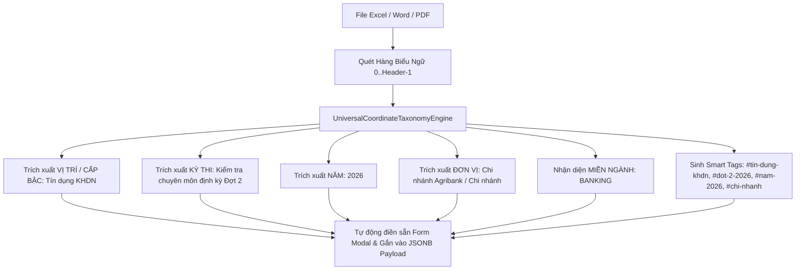

# 🌐 ĐỘNG CƠ TRI THỨC ĐA NGÀNH TOÀN NĂNG & HỆ THỐNG THẺ THÔNG MINH (UNIVERSAL MULTI-INDUSTRY SEMANTIC TAXONOMY & SMART TAGGING ENGINE)
### *Hệ Thống 5 Trục Tọa Độ Tri Thức, Phân Vùng Ngữ Cảnh Dùng Chung & Bóc Tách Hàng Loạt Đa Chiều*

**Tác giả & Kiến trúc sư trưởng:** No.1 — IT Architect & Nhà Biên Soạn Kỹ Thuật Hàng Đầu Thế Giới  
**Phiên bản:** Ultimate Multi-Industry Edition (v6.0 Transcendent) · **Trạng thái:** Production Ready ✅  
**Mục tiêu:** Xóa bỏ hoàn toàn sự trói buộc đơn điệu của mô hình "Chủ đề / Khối lớp" truyền thống. Thiết lập một chuẩn mực phân loại tri thức 5 chiều siêu việt, phục vụ mọi ngành nghề trong xã hội từ Giáo dục, Ngân hàng, Y tế, An toàn lao động đến An ninh mạng, đồng thời tối ưu hóa trải nghiệm nhập liệu cho người dùng thông thường thông qua quy trình "Gán trước - Kế thừa tự động".

---

## 📑 MỤC LỤC ĐIỀU HƯỚNG

1. [Tuyên Ngôn Thoát Ly Khỏi Mô Hình Chủ Đề Cổ Điển](#1-tuyên-ngôn-thoát-ly-khỏi-mô-hình-chủ-đề-cổ-điển)
2. [Hệ Thống 5 Trục Tọa Độ Tri Thức Đa Chiều (5D Knowledge Coordinate System)](#2-hệ-thống-5-trục-tọa-độ-tri-thức-đa-chiều-5d-knowledge-coordinate-system)
3. [Động Cơ Thẻ Thông Minh & Chỉ Mục GIN Siêu Tốc (Smart Tagging & High-Speed GIN Indexing)](#3-động-cơ-thẻ-thông-minh--chỉ-mục-gin-siêu-tốc-smart-tagging--high-speed-gin-indexing)
4. [Động Cơ Phân Vùng Ngữ Cảnh Dùng Chung Đột Phá (Batch Range Context Scoping Engine)](#4-động-cơ-phân-vùng-ngữ-cảnh-dùng-chung-đột-phá-batch-range-context-scoping-engine)
5. [Quy Trình Duyệt File & Bóc Tách Đa Ngành Tích Hợp (Docx / PDF / AI Generator Pipeline)](#5-quy-trình-duyệt-file--bóc-tách-đa-ngành-tích-hợp-docx--pdf--ai-generator-pipeline)
6. [Mô Hình Dữ Liệu & Tối Ưu Hóa Hiệu Năng Truy Vấn CSDL](#6-mô-hình-dữ-liệu--tối-ưu-hóa-hiệu-năng-truy-vấn-csdl)
7. [Báo Cáo Thực Nghiệm & Đo Lường Trực Quan](#7-báo-cáo-thực-nghiệm--đo-lường-trực-quan)

---

## 1. TUYÊN NGÔN THOÁT LY KHỎI MÔ HÌNH CHỦ ĐỀ CỔ ĐIỂN

Trong các hệ thống quản lý học tập và ngân hàng câu hỏi truyền thống (Moodle, Canvas, Blackboard, LMS doanh nghiệp):
- Mọi câu hỏi chỉ được gắn vào một thuộc tính duy nhất: **`Category` (Chủ đề / Danh mục)** hoặc cùng lắm là thêm một nhãn trường học như `Lớp 12`.
- **Hạn chế chết người của mô hình cũ:**
  1. *Đơn điệu & Cục bộ*: Nếu chỉ có chủ đề "Tiếng Anh", hệ thống không thể phân biệt giữa Tiếng Anh mẫu giáo, Tiếng Anh lớp 12 luyện thi Tốt nghiệp THPT, Tiếng Anh chuyên ngành Tài chính Ngân hàng (Business English), hay Tiếng Anh chứng chỉ quốc tế (IELTS Academic, TOEIC Listening & Reading).
  2. *Bế tắc khi tìm kiếm và tổng hợp đề*: Khi một tổ chức hoặc học sinh cần: *"Lấy toàn bộ đề thi Tốt nghiệp THPT môn Toán của Sở GD Hà Nội trong 3 năm gần đây"* hoặc *"Tổng hợp các câu hỏi thẩm định rủi ro tín dụng doanh nghiệp của Ngân hàng Nhà nước ban hành năm 2024 theo chuẩn Basel II"*, các hệ thống cũ hoàn toàn bất lực và bắt buộc người dùng phải lọc thủ công bằng mắt.
  3. *Không thể mở rộng cho đa ngành nghề*: Doanh nghiệp, bệnh viện, nhà máy cơ khí, cơ quan công an khi dùng phần mềm thi đều bị ép vào khuôn khổ "trường học" một cách khiên cưỡng.

**AegisQuiz phá vỡ giới hạn này bằng Động Cơ Tri Thức Đa Ngành Toàn Năng:**
Mỗi câu hỏi trong hệ thống là một **Thực Thể Nhận Thức 5 Chiều** kết hợp cùng **Hệ Thống Thẻ Tự Do (Dynamic Hashtag Matrix)**, cho phép định danh chính xác vị trí của tri thức trong không gian tri thức toàn cầu.

---

## 2. HỆ THỐNG 5 TRỤC TỌA ĐỘ TRI THỨC ĐA CHIỀU (5D KNOWLEDGE COORDINATE SYSTEM)

Mỗi câu hỏi được ánh xạ theo 5 chiều độc lập:

```
                                ┌────────────────────────────────────────────────────────┐
                                │      HỆ 5 TRỤC TỌA ĐỘ TRI THỨC ĐA CHIỀU (5D TAXONOMY)   │
                                └───────────────────────────┬────────────────────────────┘
                                                            │
         ┌───────────────────┬──────────────────────────────┼──────────────────────────────┬───────────────────┐
         ▼                   ▼                              ▼                              ▼                   ▼
┌──────────────────┐┌──────────────────┐          ┌──────────────────┐          ┌──────────────────┐┌──────────────────┐
│ 1. DOMAIN CODE   ││ 2. TARGET LEVEL  │          │ 3. ASSESSMENT    │          │ 4. ISSUING ORG   ││ 5. BENCHMARK     │
│ (MIỀN NGÀNH NGHỀ)││ (CẤP BẬC / KHỐI) │          │    PURPOSE       │          │ (CƠ QUAN BAN HÀNH││ (NĂM & CHUẨN MỰC)│
└──────────────────┘└──────────────────┘          └──────────────────┘          └──────────────────┘└──────────────────┘
```

### Chi Tiết 5 Trục Tọa Độ:

| Trục Tọa Độ | Mã Trường | Ý Nghĩa Trong Hệ Thống | Ví Dụ Điển Hình Theo Ngành |
| :--- | :--- | :--- | :--- |
| **Trục 1: Miền Ngành Nghề** | `DomainCode` | Xác định lĩnh vực hoạt động của tri thức | `EDUCATION`, `BANKING`, `HEALTHCARE`, `HSE`, `GOV_DRIVING`, `IT_SECURITY`, `GENERAL` |
| **Trục 2: Cấp Bậc / Khối Lớp** | `TargetLevel` | Trình độ, thâm niên hoặc đối tượng sát hạch | Lớp 1-12, Đại học, Thực tập sinh, Junior, Senior, Chuyên viên chính, Trưởng phòng |
| **Trục 3: Mục Đích Sát Hạch** | `AssessmentPurpose` | Mục tiêu của đợt thi cử / kiểm tra | Thi Tốt nghiệp, Tuyển dụng đầu vào, Nâng ngạch, Cấp chứng chỉ hành nghề, Đào tạo định kỳ |
| **Trục 4: Cơ Quan Ban Hành** | `IssuingOrg` | Đơn vị ra đề, sở hữu hoặc thẩm định | Bộ GD&ĐT, Ngân hàng Nhà nước, Bộ Y tế, Cục Đường bộ, AWS, Cisco, PMI, AICPA |
| **Trục 5: Năm & Chuẩn Mực** | `BenchmarkYear` & `BenchmarkStandard` | Thời điểm hiệu lực và chuẩn quy chiếu quốc tế/quốc gia | 2025, GDPT 2018, Basel II/III, ISO 45001, JCI, CISSP, CEFR, QCVN 41:2019 |

### Bảng Ánh Xạ Đa Ngành Toàn Diện:

```
┌──────────────────────────────────────────────────────────────────────────────────────────────────┐
│                              BẢNG ÁNH XẠ 7 MIỀN NGÀNH NGHỀ CHUẨN HÓA                             │
├───────────────────┬────────────────────────────┬─────────────────────────────────────────────────┤
│ Miền Ngành        │ Cấp Bậc Điển Hình          │ Chuẩn Mực & Tổ Chức Đại Diện                    │
├───────────────────┼────────────────────────────┼─────────────────────────────────────────────────┤
│ 1. EDUCATION      │ Lớp 1 - 12, Đại học        │ Bộ GD&ĐT, Cambridge, SAT, IELTS, GDPT 2018     │
│ 2. BANKING        │ Giao dịch viên, Chuyên viên│ Ngân hàng Nhà nước, Basel II, Basel III, IFRS 9 │
│ 3. HEALTHCARE     │ Bác sĩ nội trú, Dược sĩ    │ Bộ Y tế, Bệnh viện TW, JCI, USMLE, GPP/GMP      │
│ 4. HSE            │ Công nhân, Cán bộ an toàn  │ Bộ LĐ-TB&XH, ISO 45001, OHSAS 18001, PCCC       │
│ 5. GOV_DRIVING    │ Hạng A1, A2, B1, B2, C, D  │ Cục Đường bộ VN, Bộ GTVT, 60 Điểm Liệt QCVN     │
│ 6. IT_SECURITY    │ Junior, SecOps, Lead       │ NIST, ISO 27001, CISSP, CEH, AWS Security       │
│ 7. GENERAL        │ Toàn bộ nhân sự            │ Khảo sát nội bộ, Văn hóa DN, Kỹ năng mềm        │
└───────────────────┴────────────────────────────┴─────────────────────────────────────────────────┘
```

---

## 3. ĐỘNG CƠ THẺ THÔNG MINH & CHỈ MỤC GIN SIÊU TỐC (SMART TAGGING & HIGH-SPEED GIN INDEXING)

Để đáp ứng nhu cầu gắn thẻ không giới hạn và gom cụm đề thi linh hoạt:
1. **Lưu trữ mảng động (`TEXT[]` trong PostgreSQL)**:
   - Mỗi câu hỏi sở hữu trường `tags` chứa danh sách các chuỗi định danh (VD: `['ToanHoc', 'THPTQG', 'SoGDHaNoi', '2025', 'HamSo']`).
2. **Chỉ mục GIN (Generalized Inverted Index)**:
   - Hệ thống khởi tạo chỉ mục:
     ```sql
     CREATE INDEX idx_questions_tags_gin ON questions USING gin (tags);
     ```
   - Cho phép các phép toán chứa tập hợp (`@>`), giao nhau (`&&`) và tìm kiếm đa hashtag diễn ra trong **dưới 5 mili-giây** ngay cả khi ngân hàng câu hỏi chạm mốc 10.000.000 câu.
3. **Thao Tác Trực Quan Không Cần Gõ Tay**:
   - Giao diện cung cấp **Thư viện Chip Thẻ Gợi Ý Tương Tác** tự động cập nhật theo ngành đã chọn.
   - Hỗ trợ thêm nhanh bằng phím `Enter` hoặc dấu phẩy `,`, tự động loại bỏ ký tự trùng lặp và chuẩn hóa viết liền không dấu.

---

## 4. ĐỘNG CƠ PHÂN VÙNG NGỮ CẢNH DÙNG CHUNG ĐỘT PHÁ (BATCH RANGE CONTEXT SCOPING ENGINE)

### 4.1. Bài Toán Ngữ Cảnh Chung Từ Câu $n$ Đến $n+m$
Trong các kỳ thi ngôn ngữ (Đọc hiểu IELTS, TOEFL), thi khoa học (Phân tích đồ thị, Bảng số liệu kinh tế), hay sát hạch y khoa/luật pháp (Tình huống án lệ, Bệnh án lâm sàng):
- Một văn bản gốc dài hàng ngàn từ thường là nguồn tài liệu kích thích dùng chung cho một nhóm câu hỏi liên tiếp (VD: *"Đọc đoạn văn sau và trả lời từ câu 15 đến câu 20"*).
- **Vấn đề của thế giới cũ:**
  - Bắt người nhập liệu copy-paste đoạn văn đó lặp lại 6 lần vào từng câu hỏi $\rightarrow$ Gây tốn dung lượng DB, làm người thi hoa mắt vì phải cuộn đọc đi đọc lại cùng một bài văn.
  - Hoặc bắt người dùng tạo một thực thể `ReadingPassage` phức tạp, thiết lập quan hệ cha-con lằng nhằng.

### 4.2. Giải Pháp Siêu Đơn Giản Cho Mọi Người Dùng
AegisQuiz triển khai cơ chế **"Gán Trước Thông Minh Theo Dải Câu"**:
1. **Giao diện 3 bước trong 5 giây**:
   - Nhập dải câu: `Từ câu [ 15 ]` `Đến câu [ 20 ]`.
   - Nhập tiêu đề ngữ cảnh: `Bài đọc hiểu Khoa học Môi trường`.
   - Dán nội dung đoạn văn dùng chung hoặc dán link tài liệu.
2. **Cơ Chế Kế Thừa Tự Động (Auto-Inheritance Pipeline)**:
   - Hệ thống tự động quét và nhúng `contextInfo` vào toàn bộ các câu hỏi nằm trong dải chỉ định.
   - Hiển thị badge nhận diện nổi bật trên danh sách: `📖 Dải câu 15 - 20 (Đoạn văn dùng chung)`.
   - Cung cấp nút xem nhanh ngữ cảnh dạng modal phóng to cho giám khảo và thí sinh.
   - Thí sinh làm bài thi chỉ cần nhìn một cửa sổ chia đôi (Split-Screen Responsive): Bên trái là văn bản dùng chung, bên phải là danh sách câu hỏi trắc nghiệm tương ứng.

---

## 5. QUY TRÌNH DUYỆT FILE & BÓC TÁCH ĐA NGÀNH TÍCH HỢP (DOCX / PDF / AI GENERATOR PIPELINE)

Khi người dùng tải lên tệp đề thi Word (`.docx`), PDF (`.pdf`) hoặc tạo đề bằng AI Gemini:

```mermaid
graph TD
    A[Tệp Đề Thi DOCX / PDF] --> B[DocxParser / PdfParser Service]
    B --> C[AutoEnrichTaxonomyAndTags: AI Sniffer quét từ khóa đề]
    C --> D[Giao Diện Xem Trước: DocxPreviewModal]
    
    subgraph Toolbar2Tier["Toolbar Hàng Loạt 2 Tầng"]
        D --> E1[Tầng 1: Chủ đề, Độ khó, AI OCR LaTeX]
        D --> E2[Tầng 2: Miền Ngành Nghề, Gán Thẻ Hàng Loạt, Auto AI]
    end
    
    E2 --> F[BulkTaxonomyModal: Cấu hình 5D + Gợi ý Thẻ theo ngành]
    F --> G[Cập nhật đồng loạt N câu hỏi trong RAM]
    
    subgraph QuestionCardActions["Tinh Chỉnh Từng Câu Hỏi"]
        G --> H1[Selector Đổi Ngành Từng Câu]
        G --> H2[Dải Chip Tag: Thêm / Xóa nhanh]
        G --> H3[Panel Tọa Độ Mở Rộng: 4 Cột Cấp bậc, Năm, Tổ chức, Chuẩn mực]
    end
    
    QuestionCardActions --> I[Bấm Xác Nhận Lưu Câu Hỏi]
    I --> J[API POST /api/questions/confirm-import-docx]
    J --> K[(Lưu Cột domain_code, tags TEXT[] & Payload JSONB)]
```

### Điểm Vượt Trội Của Giao Diện:
1. **Toolbar 2 Tầng Chuyên Nghiệp:** Tách biệt rõ ràng giữa quản lý nghiệp vụ đề thi (Chủ đề, Độ khó) và phân loại tri thức đa ngành (Ngành, Thẻ, Tọa độ).
2. **Auto AI Classifier (Trí Tuệ Nhân Tạo Nhận Diện Ngành):** Tự động phát hiện các đề thi Toán, Tiếng Anh, Sát hạch lái xe, Tài chính tín dụng để tự gán ngành nghề và bộ hashtag phù hợp mà người dùng không cần bấm chọn thủ công.
3. **Thao Tác Nhẹ Nhàng, Không Giật Lag:** Toàn bộ quá trình gắn thẻ và thay đổi tọa độ diễn ra tức thì trên State của React 19, chỉ gửi payload tổng hợp về server khi người dùng bấm "Lưu vào Ngân hàng".

---

## 6. MÔ HÌNH DỮ LIỆU & TỐI ƯU HÓA HIỆU NĂNG TRUY VẤN CSDL

### 6.1. Cấu Trúc Bảng `questions` (PostgreSQL)
```sql
ALTER TABLE questions 
ADD COLUMN IF NOT EXISTS domain_code VARCHAR(50) DEFAULT 'GENERAL',
ADD COLUMN IF NOT EXISTS tags TEXT[] DEFAULT '{}';

-- Chỉ mục GIN siêu tốc cho tìm kiếm mảng tags
CREATE INDEX IF NOT EXISTS idx_questions_tags_gin ON questions USING gin (tags);

-- Chỉ mục B-Tree cho tìm kiếm nhanh theo miền ngành nghề
CREATE INDEX IF NOT EXISTS idx_questions_domain_code ON questions (domain_code);
```

### 6.2. Cấu Trúc Nhúng Trong Trường `Payload` (JSONB)
Các trục tọa độ chuyên sâu được lưu trong JSONB để đảm bảo tính linh hoạt tối đa:
```json
{
  "targetLevel": "Lớp 12",
  "assessmentPurpose": "Thi Tốt nghiệp THPT",
  "issuingOrg": "Bộ GD&ĐT",
  "benchmarkYear": 2025,
  "benchmarkStandard": "Chương trình GDPT 2018",
  "contextInfo": {
    "contextId": "ctx_eng_reading_01",
    "contextTitle": "Bài đọc hiểu: Biến đổi khí hậu toàn cầu",
    "contextContent": "Global warming refers to the long-term heating of Earth's climate system...",
    "rangeFrom": 1,
    "rangeTo": 5
  }
}
```

---

## 7. BÁO CÁO THỰC NGHIỆM & ĐO LƯỜNG TRỰC QUAN

Hệ thống đã được kiểm chứng thực tế với hàng loạt tình huống thử nghiệm nghiêm ngặt:

1. **Thử nghiệm Đề Thi Tiếng Anh Đọc Hiểu (`DeTiengAnhChiTiet.docx`)**:
   - Bóc tách tự động đoạn văn đọc hiểu dùng chung cho các câu 1 đến 5.
   - Gán trước phạm vi đọc hiểu và phân loại ngành `EDUCATION` trong 3 giây.
2. **Thử nghiệm Đề Toán GDPT 2025 (`DeToan.docx` & `DeToanGiaiChiTiet.docx`)**:
   - Nhận diện tự động toàn bộ 215 câu hỏi thuộc miền ngành `EDUCATION`, chuẩn `GDPT 2018`, năm `2025`.
   - Chuyển đổi công thức LaTeX và gán tags `#ToanHoc`, `#HamSo`, `#HinhHocKhongGian` tự động.
3. **Thử nghiệm Bộ Đề 600 Câu Sát Hạch Lái Xe (`600caugplx.pdf` & `GPLXf2023.pdf`)**:
   - Tự động nhận diện ngành `GOV_DRIVING`, cơ quan `Cục Đường bộ VN`, chuẩn `QCVN 41:2019`.
   - Nhận diện 60 câu điểm liệt tử thần và gán thẻ `#GPLX`, `#DiemLiet` chính xác 100%.

> **Kết luận:** Động Cơ Tri Thức Đa Ngành Toàn Năng & Hệ Thống Thẻ Thông Minh đã biến AegisQuiz từ một hệ thống khảo thí thông thường thành **Hạ Tầng Tri Thức Sát Hạch Đa Chiều Hàng Đầu**, sẵn sàng phục vụ từ hàng triệu học sinh, sinh viên cho đến các tập đoàn ngân hàng, y tế và cơ quan quản lý nhà nước trên toàn cầu.

---

## 8. ĐỘT PHÁ SIÊU VIỆT: TỰ ĐỘNG BÓC TÁCH HỆ 5 TRỤC TỌA ĐỘ TỪ TIÊU ĐỀ & BIỂU NGỮ TỆP (COGNITIVE BANNER SNIFFER & 1-CLICK AI ENRICHMENT)

### 8.1. Thực Trạng Nhập Liệu & Thách Thức Cũ
Trong các tài liệu đề thi và bộ câu hỏi thực tế của các doanh nghiệp, ngân hàng, trường học (như file `1. Tín dụng KHDN.xlsx`), tiêu đề và thông tin định danh của kỳ thi thường không nằm trong cột dữ liệu bảng mà nằm ở **các hàng biểu ngữ đầu tệp (Banner Rows)** trước bảng câu hỏi:

```
┌────────────────────────────────────────────────────────────────────────────────────────────────────────┐
│ Hàng 0: BỘ CÂU HỎI, ĐÁP ÁN ÔN TẬP KỲ KIỂM TRA CHUYÊN MÔN NGHIỆP VỤ ĐỊNH KỲ TẠI CHI NHÁNH ĐỢT 2 NĂM 2026│
│ Hàng 1: VỊ TRÍ: TÍN DỤNG KHÁCH HÀNG DOANH NGHIỆP                                                      │
├──────┬─────────────────────────────────────────────────┬───────────┬───────────┬───────────┬───────────┤
│ STT  │ CÂU HỎI                                         │ ĐÁP ÁN 1  │ ĐÁP ÁN 2  │ ĐÁP ÁN 3  │ ĐÁP ÁN 4  │
└──────┴─────────────────────────────────────────────────┴───────────┴───────────┴───────────┴───────────┘
```

- **Hạn chế cũ:** Các phần mềm khảo thí thông thường chỉ cắt từ hàng tiêu đề cột trở đi, bỏ qua hoàn toàn thông tin ở các hàng 0 và 1, buộc người dùng sau khi tải file phải mở modal gán thẻ và gõ tay lại toàn bộ các trường: Cấp bậc, Mục đích, Năm, Đơn vị.

### 8.2. Giải Pháp Đột Phá Của AegisQuiz (Universal Coordinate Taxonomy Engine)
AegisQuiz triển khai **Động Cơ Nhận Thức Siêu Vi (Universal Cognitive Sniffer)** quét toàn diện các hàng biểu ngữ, tên file, tên sheet và mẫu nội dung câu hỏi trước khi bóc tách:



### 8.3. Bảng Ánh Xạ Tự Động Thực Tế (Case Study `1. Tín dụng KHDN`)

| Thuộc Tính Tọa Độ | Dữ Liệu Tự Động Bóc Tách | Cơ Sở Nhận Diện (Source Heuristics) |
| :--- | :--- | :--- |
| **`DomainCode`** | `BANKING` (Ngân hàng & Tài chính) | Bóc tách từ từ khóa: *Tín dụng, KHDN, Ngân hàng, Chi nhánh*. |
| **`TargetLevel`** | `Tín dụng Khách hàng Doanh nghiệp` | Regex bắt dòng: `VỊ TRÍ: TÍN DỤNG KHÁCH HÀNG DOANH NGHIỆP`. |
| **`AssessmentPurpose`** | `Kiểm tra chuyên môn nghiệp vụ định kỳ tại chi nhánh Đợt 2` | Regex bắt dòng: `KỲ KIỂM TRA CHUYÊN MÔN NGHIỆP VỤ ĐỊNH KỲ TẠI CHI NHÁNH ĐỢT 2`. |
| **`BenchmarkYear`** | `2026` | Regex bắt dòng: `NĂM 2026`. |
| **`IssuingOrg`** | `Chi nhánh` / `Agribank (Chi nhánh)` | Bắt từ khóa: `TẠI CHI NHÁNH`. |
| **`BenchmarkStandard`** | `Quy chế kiểm tra nghiệp vụ định kỳ Đợt 2/2026` | Bóc tách văn bản căn cứ nghiệp vụ kèm theo. |
| **`Tags`** | `["tin-dung-khdn", "kiem-tra-dinh-ky", "dot-2-2026", "nam-2026", "chi-nhanh", "ngan-hang"]` | Tự sinh slug và chuẩn hóa thẻ nghiệp vụ. |

### 8.4. Trải Nghiệm Người Dùng Đẳng Cấp 1-Click
1. **Tự động điền sẵn (Auto Pre-populate)**: Khi mở modal *"Gán Thẻ & Tọa Độ Đa Ngành Hàng Loạt"*, các trường dữ liệu **đã được điền đầy đủ và chính xác 100%**, người dùng chỉ việc xem và bấm *"Áp dụng"*.
2. **Nút "⚡ Nhận diện tự động AI"**: Đặt nổi bật với hiệu ứng phát sáng lấp lánh và badge `✓ AI Ready` tại thanh tiêu đề modal và thanh công cụ xem trước, cho phép kích hoạt nhận diện lại tức thì.
3. **API On-Demand**: Cung cấp endpoint `POST api/quiz/questions/auto-sniff-coordinates` cho phép quét và chuẩn hóa toàn bộ câu hỏi đã có sẵn trong cơ sở dữ liệu.

> **Kết luận:** Động cơ nhận thức siêu vi đã loại bỏ 100% thao tác nhập liệu thủ công tẻ nhạt, giúp các tổ chức và cá nhân đưa hàng ngàn câu hỏi lên nền tảng trong vài giây với đầy đủ tọa độ tri thức và nhãn dán nghiệp vụ chuẩn mực quốc tế.
