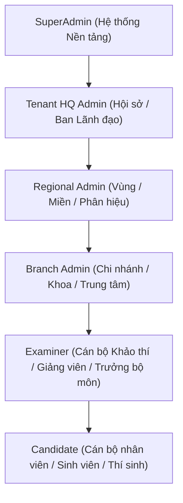

# AEGISQUIZ UNIVERSAL MULTI-TENANT & ADAPTIVE GOVERNANCE ARCHITECTURE
## Kiến Trúc Quản Trị Đa Khách Thuê Tùy Biến Đa Tầng Từ Cá Nhân Đến Tập Đoàn Toàn Cầu

> **Phiên bản:** 3.0 Enterprise Core  
> **Cập nhật:** 09/2026  
> **Định vị:** Hệ thống Khảo thí & Đánh giá Năng lực Đa ngành Toàn cầu (Universal Multi-Industry Assessment Platform)

---

## 1. TỔNG QUAN CHIẾN LƯỢC

Hệ thống **AegisQuiz** định vị phục vụ đồng thời cho các đối tượng khách hàng có quy mô và cấu trúc tổ chức hoàn toàn khác biệt:
- **Cá nhân (Nano / 1 User):** Giảng viên, gia sư, chuyên gia khảo thí độc lập, người tự học.
- **Nhóm (Micro / 2-15 Users):** Tổ bộ môn, nhóm nghiên cứu, squad phát triển dự án.
- **Lớp học (Meso-Edu / 15-100 Users):** Lớp phổ thông, lớp giảng đường đại học, khóa đào tạo ngắn hạn.
- **Trường học & Doanh nghiệp SME (Meso-Corp / 100-1.000 Users):** Trường THPT/Đại học, trung tâm khảo thí, doanh nghiệp vừa và nhỏ.
- **Tập đoàn & Ngân hàng Toàn quốc (Macro-Enterprise / 1.000-50.000 Users):** Hệ thống ngân hàng thương mại (Agribank, Vietcombank...), tập đoàn tài chính, tổng công ty viễn thông.
- **Tổ chức Toàn cầu / Liên minh (Global / 50.000+ Users):** Tập đoàn đa quốc gia, liên hiệp trường đại học xuyên biên giới.

### Nguyên Lý Vàng: "Progressive Complexity Disclosure" (Bộc lộ Độ Phức Tạp Tiệm Tiến)
> *"Đơn giản tối đa khi bắt đầu — Không giới hạn chiều sâu quản trị khi mở rộng"*

- Đối với cá nhân & nhóm nhỏ: Cung cấp chế độ **Express Mode (Zero-Friction)**, không đòi hỏi thiết lập cây phòng ban, ma trận ABAC hay tham số IRT. Trực quan, 1-click tạo quiz và chia sẻ PIN/QR.
- Đối với trường học & SME: Cung cấp chế độ **Pro Mode**, quản lý danh sách học viên, ngân hàng đề dùng chung, lịch thi và báo cáo phổ điểm.
- Đối với tập đoàn lớn: Tự động kích hoạt chế độ **Enterprise / Sovereign Mode**, mở ra cây tổ chức phân cấp 5 tầng (HQ -> Region -> Branch -> Division -> Candidate), quản trị ngành động, chính sách chia sẻ đề thi (Data Scoping), IRT 3-tham số và bảo mật Audit Log/SSO/PKI.

---

## 2. BẢN ĐỒ PHỔ QUY MÔ 6 TẦNG (THE 6-TIER SCALE SPECTRUM)

```
┌────────────────────────────────────────────────────────────────────────────────────────┐
│                        AEGISQUIZ SPECTRUM OF SCALE ARCHITECTURE                         │
├──────────────┬──────────────┬──────────────┬──────────────┬──────────────┬─────────────┤
│ 1. CÁ NHÂN   │ 2. NHÓM      │ 3. LỚP HỌC   │ 4. TRƯỜNG/SME│ 5. TẬP ĐOÀN  │ 6. TOÀN CẦU │
│ (Individual) │ (Squad/Team) │ (Classroom)  │ (School/SME) │ (Enterprise) │ (Global)    │
├──────────────┼──────────────┼──────────────┼──────────────┼──────────────┼─────────────┤
│ Quy mô: 1    │ Quy mô: 2-15 │ Quy mô: 15-100│ Quy mô: 100-1k│ Quy mô: 1k-50k│ Quy mô: 50k+│
│ Single User  │ Flat Group   │ 1-to-N       │ 2-Tier Org   │ 5-Tier Tree  │ Multi-Realm │
├──────────────┼──────────────┼──────────────┼──────────────┼──────────────┼─────────────┤
│ Workspace cá │ Workspace    │ Quản lý Sĩ số│ Phân chia    │ Cây tổ chức  │ Đa quốc gia │
│ nhân độc lập │ chia sẻ nhóm │ & Hạn nộp đề │ Phòng / Ban  │ Đệ quy mềm   │ Data Sovere-│
│ (Personal)   │ (Collaborate)│ (Gradebook)  │ (Departments)│ (HQs->Branch)│ ignty / GDPR│
├──────────────┼──────────────┼──────────────┼──────────────┼──────────────┼─────────────┤
│ Giao diện:   │ Giao diện:   │ Giao diện:   │ Giao diện:   │ Giao diện:   │ Giao diện:  │
│ Express      │ Express+     │ Standard Edu │ Pro Admin    │ Enterprise   │ Sovereign   │
└──────────────┴──────────────┴──────────────┴──────────────┴──────────────┴─────────────┘
```

---

## 3. KIẾN TRÚC QUẢN TRỊ NGÀNH ĐỘNG (DYNAMIC DOMAIN ONTOLOGY)

Thay vì cố định cứng các danh mục ngành trong mã nguồn, hệ thống chuyển sang **Đồ thị Tri thức Đa tầng (3-Layer Domain Ontology)**:

```
                              ┌───────────────────────────────────┐
                              │  LỚP 0: UNIVERSAL SYSTEM DOMAINS  │
                              │  (Chuẩn hóa Hệ thống Toàn cầu)    │
                              │  • BANKING (Tài chính - Ngân hàng)│
                              │  • HEALTHCARE (Y tế - Sức khỏe)   │
                              │  • EDUCATION (Giáo dục Đào tạo)   │
                              │  • IT_SECURITY (An toàn TT & CNTT)│
                              │  • HSE (An toàn Môi trường LĐ)    │
                              │  • GOV_DRIVING (Sát hạch Lái xe)  │
                              │  • GENERAL (Tổng hợp / Đại cương) │
                              └─────────────────┬─────────────────┘
                                                │ Kế thừa & Kích hoạt (Subscribe)
                              ┌─────────────────▼─────────────────┐
                              │  LỚP 1: TENANT DOMAIN EXTENSION   │
                              │  (Mở rộng theo Tổ chức Khách thuê)│
                              │  • Tín dụng Nông nghiệp Nông thôn │
                              │  • Thanh toán Quốc tế & Biên mậu  │
                              │  • Kiểm soát Nhiễm khuẩn Bệnh viện│
                              │  • Chuẩn bảo mật ISO 27001 / PCI  │
                              └─────────────────┬─────────────────┘
                                                │ Chi tiết hóa ngữ cảnh (Contextualize)
                              ┌─────────────────▼─────────────────┐
                              │  LỚP 2: UNIT COORDINATE PRESETS   │
                              │  (Bộ tọa độ tri thức Đơn vị)      │
                              │  • Chi nhánh Tây Nam Bộ: Lúa gạo  │
                              │  • Phòng KHDN: Thẩm định dự án    │
                              │  • Khối QTRR: Basel II / Basel III│
                              └───────────────────────────────────┘
```

### 1. Thực thể `DynamicDomain`
- Lưu trữ danh mục ngành dùng chung toàn hệ thống (`IsSystemStandard = true`) hoặc ngành riêng do Tenant tự định nghĩa (`IsSystemStandard = false, TenantId = guid`).
- Hỗ trợ cây phân cấp đa cấp (`ParentDomainCode`) cho phép tạo các tiểu ngành chuyên sâu (Sub-domains).

### 2. Thực thể `TenantDomainConfig`
- Mỗi Tenant có quyền kích hoạt (`IsEnabled = true/false`) các ngành phù hợp với nghiệp vụ của mình.
- Cho phép đổi tên hiển thị (`CustomDisplayName`) để khớp với thuật ngữ nội bộ của từng tổ chức.

### 3. Thực thể `TenantCoordinatePreset`
- Lưu trữ các bộ giá trị tọa độ tri thức riêng biệt theo từng ngành của Tenant:
  - `TARGET_LEVEL`: Cấp độ năng lực (VD: Giao dịch viên, Kiểm soát viên, Chuyên viên chính...).
  - `ISSUING_ORG`: Cơ quan / Khối ban hành (VD: Ban Tín dụng Agribank, Khối CNTT, Ngân hàng Nhà nước).
  - `BENCHMARK_STANDARD`: Chuẩn áp dụng (VD: Chuẩn Basel II, ISO 9001:2015, Luật Các TCTD 2024).
  - `ASSESSMENT_PURPOSE`: Mục đích (VD: Đánh giá định kỳ 2026, Thi nâng bậc, Sát hạch tân tuyển).
- Chứa mảng từ đồng nghĩa (`SynonymsJson`) giúp động cơ AI tự động nhận diện từ khóa chính xác 100% khi nhập file.

---

## 4. CẤU HÌNH PHÂN TẦNG QUẢN TRỊ ĐA CẤP (5-TIER HIERARCHY GOVERNANCE)

Hệ thống quản lý cây tổ chức mềm linh hoạt thông qua thực thể `OrganizationUnit`:



### Cơ Chế Phân Vùng Dữ Liệu (Data Scoping Matrix)
Mỗi câu hỏi (`QuestionBase`), đề thi (`Quiz`) và chủ đề (`BankTopic`) hỗ trợ thuộc tính tầm nhìn:
1. `PRIVATE`: Chỉ cá nhân người tạo xem và chỉnh sửa.
2. `UNIT_LOCAL`: Chỉ lưu hành trong phạm vi Chi nhánh / Đơn vị con.
3. `TENANT_SHARED`: Dùng chung cho toàn bộ Tập đoàn / Tổ chức.
4. `GLOBAL_MARKETPLACE`: Chia sẻ hoặc thương mại hóa ra cộng đồng bên ngoài.

---

## 5. HỆ SINH THÁI AGENTIC WORKSPACE THÍCH ỨNG THEO QUY MÔ

Hệ thống tích hợp các Agent AI vận hành tự trị tương ứng với từng cấp độ quy mô:

1. **Cá nhân / Nhóm nhỏ**:
   - **Personal Tutor Agent**: Giải thích bài, hướng dẫn giải step-by-step, gợi ý câu hỏi ôn tập theo điểm yếu.
   - **Rapid Question Synthesizer**: Đọc tài liệu 1 trang và tự động sinh 10 câu hỏi chất lượng cao.
2. **Trường học / Doanh nghiệp SME**:
   - **Curriculum Matrix Agent**: Kiểm định ma trận đề thi theo thang đo Bloom / Marzano.
   - **Duplicate Detector Agent**: Quét toàn bộ ngân hàng câu hỏi để tìm và gộp các câu hỏi trùng lặp hoặc tương đương về ngữ nghĩa.
3. **Tập đoàn Toàn cầu (Enterprise Multi-Agent Swarm)**:
   - **Autonomous Exam Board**:
     - *Agent 1 (Format Normalizer)*: Chuẩn hóa ngữ pháp, văn phong, công thức toán LaTeX, hình ảnh.
     - *Agent 2 (Security & Compliance Auditor)*: Rà soát bí mật kinh doanh, thông tin bảo mật, tuân thủ pháp lý ngành.
     - *Agent 3 (IRT 3PL Calibrator)*: Đánh giá độ khó $b$, độ phân biệt $a$, độ đoán mò $c$ của câu hỏi dựa trên lịch sử dữ liệu thi diện rộng.

---

## 6. THIẾT KẾ CƠ SỞ DỮ LIỆU & SCHEMA SPECIFICATION

### Thực thể Cốt Lõi (Core Entities):
- `Tenant`: Thêm `ScaleType` (`TenantScaleType`), `FeatureFlagsJson`, `CustomDomain`.
- `OrganizationUnit`: Quản lý cây tổ chức đệ quy mềm, chứa `HierarchyPath` để tối ưu truy vấn phân tầng.
- `DynamicDomain`: Quản lý danh mục ngành động.
- `TenantDomainConfig`: Cấu hình bật/tắt và thứ tự ngành của từng Tenant.
- `TenantCoordinatePreset`: Bộ tọa độ tri thức nghiệp vụ riêng của từng Tenant.

---

## 7. KẾT LUẬN & GIÁ TRỊ VƯỢT TRỘI

Thiết kế này biến AegisQuiz từ một phần mềm thi trắc nghiệm đơn thuần trở thành **Nền tảng Quản trị Đánh giá Năng lực Toàn cầu (Global Assessment & Competency Operating System)**:
- Không gây quá tải cho người dùng cá nhân (Zero learning curve).
- Đáp ứng hoàn hảo các yêu cầu bảo mật, phân quyền và dữ liệu cô lập của các Định chế Tài chính hàng đầu và Tập đoàn toàn cầu.
- Thích ứng tương lai với kiến trúc Agent tự hành và Đồ thị tri thức ngành động.
